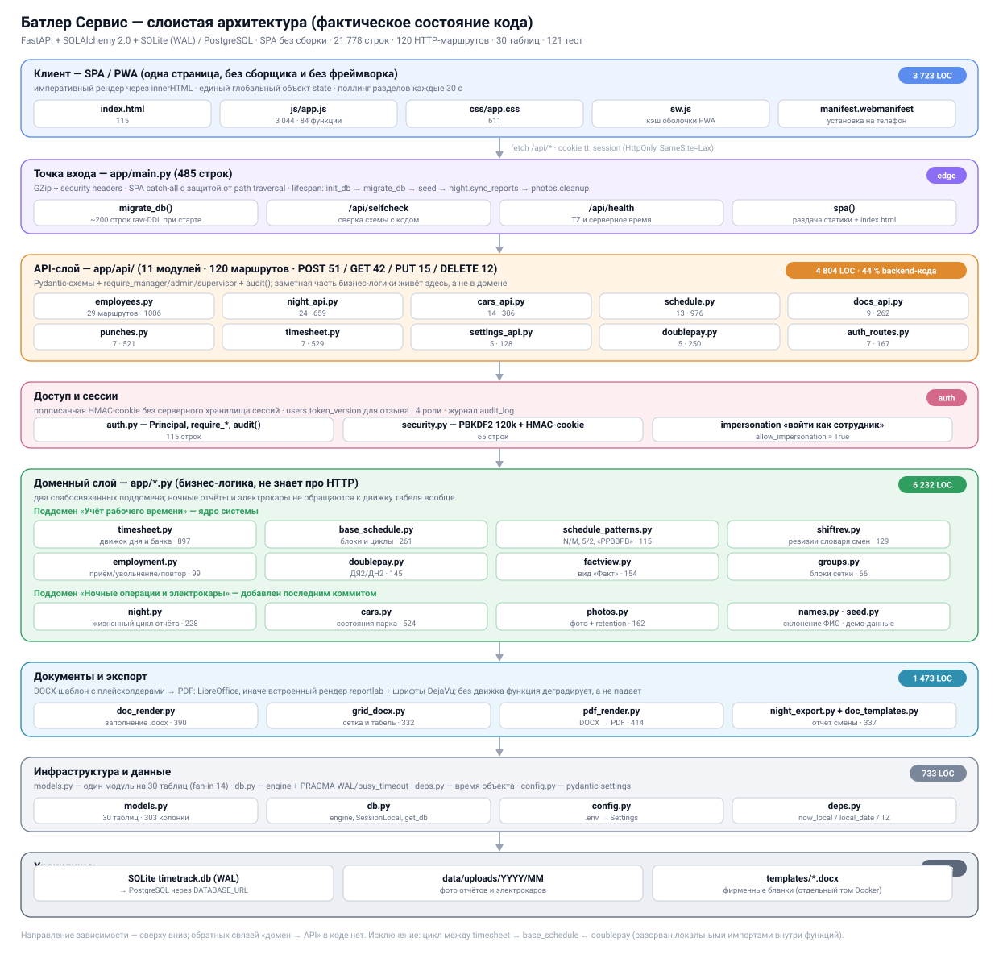
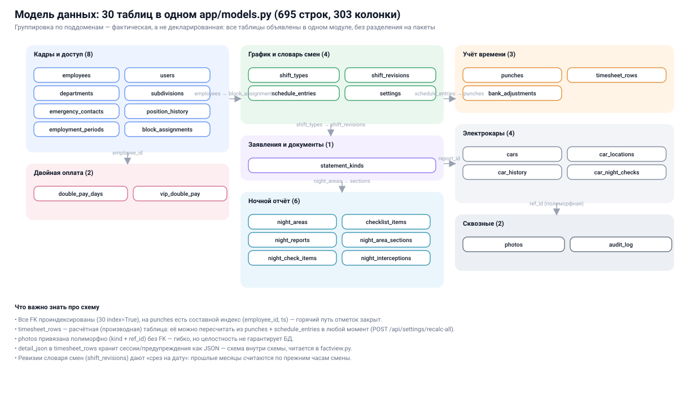
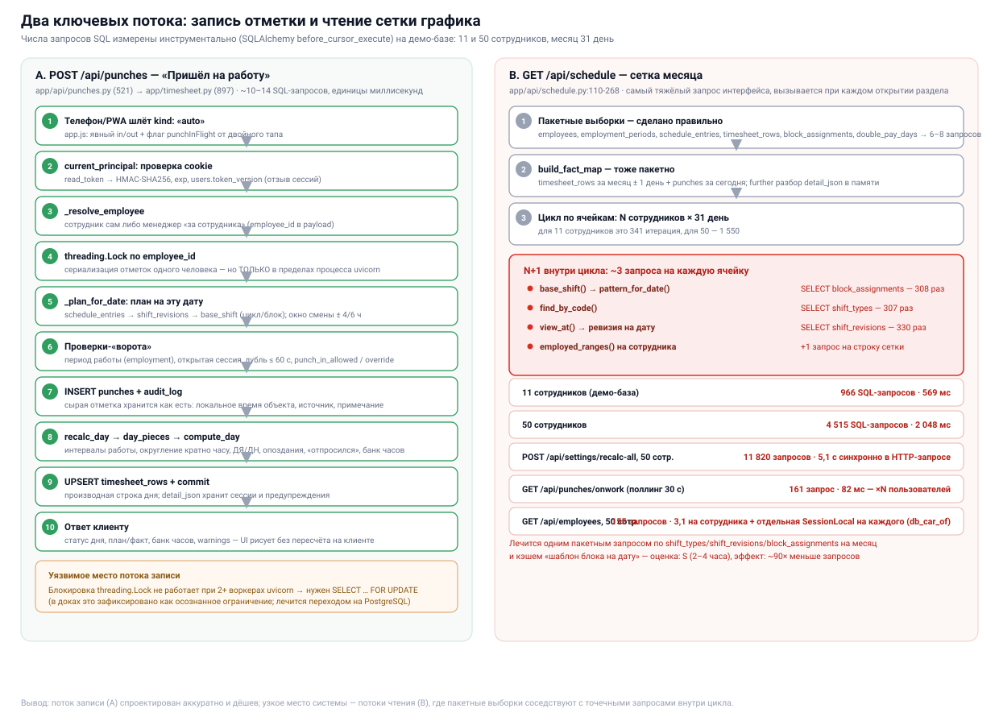
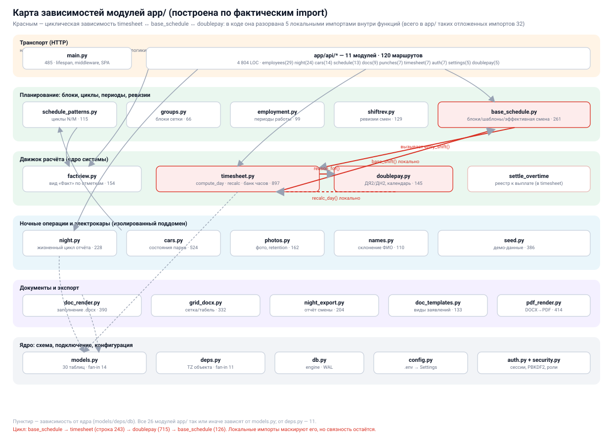

# «Батлер Сервис» (butler-service) — архитектурный разбор

**Репозиторий:** https://github.com/nikolaifedorenko/butler-service · коммит `22cb5d5`
**Дата анализа:** 28.09.2026
**Фокус:** архитектура, связи модулей, модель данных, потоки выполнения, онбординг
**Как получен фактический материал:** клонирование репозитория, статический анализ импортов, инструментальный подсчёт SQL-запросов (`SQLAlchemy before_cursor_execute`), полный прогон тестов (121 тест, 99,5 с)

---

## 1. Резюме

Это **зрелый предметно-ориентированный монолит** на FastAPI: система учёта рабочего времени для службы батлеров (графики смен, отметки с телефона, табель, банк часов, заявления в DOCX/PDF), к которой последним коммитом добавлены два самостоятельных поддомена — ночные отчёты и парк электрокаров.

Главная architectural-ценность проекта — **доменный движок расчёта**. `compute_day()` по сути чистая функция от `(employee, date, entry, data, rules)`, вся производная таблица `timesheet_rows` пересчитываема из сырых отметок в любой момент, а модель данных учитывает вещи, которые обычно ломают такие системы: ревизии словаря смен («срез на дату»), периоды работы (приём → увольнение → повторный приём), историю блоков графика и частичное отсутствие внутри смены. Это уровень выше среднего для внутреннего инструмента.

Главные архитектурные проблемы — **не в логике, а в границах и в масштабируемости чтения**:

| Что | Влияние | Оценка |
|---|---|---|
| N+1 в `GET /api/schedule` (966 запросов на 11 сотрудниках, 4 515 — на 50) | сетка месяца тормозит линейно с ростом штата; 2 с на 50 сотрудниках | 🔴 высокое |
| `recalc-all` — 11 820 запросов и 5,1 с **синхронно в HTTP-запросе** | таймауты gateway при росте штата, блокировка воркера | 🔴 высокое |
| Самодельные миграции (~200 строк raw DDL при каждом старте) + отдельный `selfcheck` | два источника правды о схеме, дрейф уже случился (6 колонок не проверяются) | 🟠 среднее |
| Цикл `timesheet ↔ base_schedule ↔ doublepay`, разорванный 13 локальными импортами | нельзя понять порядок инициализации и безопасно вынести модуль | 🟠 среднее |
| 44 % backend-кода живёт в `app/api/`, включая `employees.py` (1 006 строк) и `schedule.py` (976) | логика переводов/блоков/сетки не переиспользуема и не тестируема вне HTTP | 🟠 среднее |
| Иллюзорная изоляция тестов: все 121 тест работают против **одной** БД | порядок запуска влияет на результат; найден падающий тест-«мина» | 🟠 среднее |
| Документация: `SPEC.md` содержит 4 расходящиеся копии разделов 1–6 | новый разработчик не может определить, какая версия правдива | 🟡 заметное |

**Вердикт:** код healthy и пригоден к развитию «вглубь» (новые фичи в текущей архитектуре добавляются легко — это видно по последнему коммиту на +2 600 строк). Но перед ростом штата (50+ сотрудников) и перед ростом команды (2+ разработчика) нужно закрыть три вещи: **производительность чтения, управляемость схемы (Alembic), границы слоёв**. Все три решаются без переписывания.

---

## 2. Что это за система

### 2.1 Предметная область

Учёт рабочего времени посменного персонала объекта (отель/резиденция: батлеры, старшие батлеры, менеджеры, документооборот). Ключевая особенность домена — **ночные смены через полночь** и **два контура учёта**:

- **ФАКТ/БАНК** (внутренний): сессия относится к дню начала; если хвост сессии накрывает план следующего дня, она делится по границе плана;
- **РЕЕСТР К ВЫПЛАТЕ** (внешний): часы раскладываются по календарным дням, из них вычитается «официальное окно» дня, остаток — начисления ДЯ (06:00–22:00) / ДН (22:00–06:00) и ДЯ2/ДН2 (двойной тариф в дни производственного календаря и ВИП-заездов).

Учёт ведётся кратно часу (округление настраивается), деньги не считаются — только часы.

### 2.2 Три поддомена в одном монолите

| Поддомен | Модули | Маршрутов | Связь с ядром |
|---|---|---|---|
| **Учёт рабочего времени** (ядро) | `timesheet`, `base_schedule`, `schedule_patterns`, `shiftrev`, `employment`, `doublepay`, `factview`, `groups` | ~60 | — |
| **Ночные отчёты** | `night`, `night_export`, `photos` | 24 | только общие `models`/`db`/`auth`/`photos`; к движку табеля не обращается |
| **Электрокары** | `cars` (+ `photos`) | 14 | то же; состояние парка и ночная проверка каров |

Проверено: в `night.py`, `cars.py`, `api/night_api.py`, `api/cars_api.py` **ноль** обращений к `timesheet`/`recalc`. Это хорошо (поддомены независимы) и плохо одновременно (граница никак не выражена в структуре каталогов — всё лежит в одном `app/`).

### 2.3 Цифры

| Показатель | Значение |
|---|---|
| Строк кода и документации | 21 778 |
| Backend (`app/` без `api/`) | 6 232 (28,6 %) |
| API-слой (`app/api/`) | 4 804 (22,1 %) |
| Фронтенд (`static/js` + `css`) | 3 655 (16,8 %) |
| Тесты | 2 644 (12,1 %) · 121 тест |
| Утилиты (`tools/`) | 2 467 (11,3 %) |
| Документация | 1 976 (9,1 %) |
| HTTP-маршрутов | 120 (POST 51 · GET 42 · PUT 15 · DELETE 12) |
| Таблиц БД / колонок | 30 / 303 |
| Python-модулей | 26 в `app/` + 11 в `app/api/` |
| Зависимостей | 10 обязательных + 4 dev + 2 опциональных (PDF) |

---

## 3. Слои и модули



Слоистость соблюдена **по направлению зависимости**: клиент → `main.py` → `app/api/*` → домен → инфраструктура. Обратных связей «домен → API» нет ни одной: доменные модули не импортируют `fastapi` и не знают про HTTP. Это сильная сторона, которую стоит сохранить.

### 3.1 Транспорт: `main.py` (485 строк)

Точка входа совмещает пять разных задач, которые в идеале живут отдельно:

1. сборка `FastAPI` + middleware (GZip, security headers, `Cache-Control: no-store` для `/api/*`);
2. **`migrate_db()` — ~200 строк raw DDL** (`ALTER TABLE ... ADD COLUMN`, `UPDATE`-переносы данных, создание индексов), выполняется при каждом старте;
3. `init_db()` + `seed_if_empty()` (демо-данные: 11 сотрудников, 4 блока, 3 месяца графиков);
4. фоновая синхронизация при старте: `night.sync_reports()` (создать отчёты за пропущенные ночи, автозакрытие наступивших) + `photos.cleanup_photos()` (retention);
5. раздача SPA: catch-all `spa()` с защитой от path traversal, `/sw.js` и манифест с корня.

Плюс два служебных эндпоинта: `/api/health` (время в TZ объекта) и `/api/selfcheck` (сверка схемы БД с ожиданиями кода).

### 3.2 API-слой: 11 модулей, 4 804 строки

| Модуль | Маршрутов | LOC | Что внутри |
|---|---|---|---|
| `employees.py` | 29 | 1 006 | карточки, переводы должностей/блоков, увольнение, повторный приём, банк-корректировки, департаменты, службы, **словарь смен с ревизиями** |
| `night_api.py` | 24 | 659 | ночной отчёт: зоны, чек-листы, закрытие секций, перехваты, кары ночью, фото |
| `cars_api.py` | 14 | 306 | парк: взять/передать/выдать/вернуть/закрепить/статус, история, локации |
| `schedule.py` | 13 | 976 | **сборка сетки месяца**, редактор ячейки, назначения на период, шаблоны, копирование, XLSX/PDF |
| `docs_api.py` | 9 | 262 | виды заявлений, бланки .docx, рендер в DOCX/PDF |
| `punches.py` | 7 | 521 | отметки, журнал, «кто на работе», посещение за день |
| `timesheet.py` | 7 | 529 | табель, CSV/XLSX/PDF, переработки, пересчёт, аудит |
| `auth_routes.py` | 7 | 167 | вход/выход, `me`, смена пароля, impersonation |
| `settings_api.py` | 5 | 128 | правила расчёта, базовый цикл, реквизиты, `recalc-all` |
| `doublepay.py` | 5 | 250 | дни двойной оплаты и ВИП-периоды |

**Наблюдение:** API-модули — не «тонкие контроллеры». В `employees.py` живут `normalize_block_history()`, `_touch_block()`, `_build_pattern_json()`, `_touch_position()` — то есть доменная логика переводов и истории блоков. В `schedule.py` — вся сборка сетки (`get_grid`, 158 строк) и применение ячейки (`_apply_cell`). Эти функции нельзя переиспользовать из скрипта или из теста без поднятия HTTP.

### 3.3 Домен

`timesheet.py` (897 строк) — ядро. Внутри различимы четыре responsibility, которые сейчас слиты в один модуль:

- **правила** (`DEFAULT_RULES`, `coerce_rules`, `load_rules`) — настройки округления, ночного окна, grace-минут;
- **интервальная арифметика** (`split_intervals`, `_merge_intervals`, `_subtract`, `subtract_holes`, `round_dt`) — чистые функции, идеальны для юнит-тестов;
- **расчёт дня** (`day_pieces`, `plan_segments`, `official_segments`, `compute_day`) — сборка строки табеля;
- **банк часов и реестр выплат** (`bank_as_of`, `settle_overtime`, `PAY_BUCKETS`) — накопительная логика со сквозным долгом.

`base_schedule.py` — разрешение «какая смена у сотрудника в эту дату» с учётом блока, индивидуального шаблона и ревизии словаря. `schedule_patterns.py` — арифметика циклов (2/2, 3/3, 5/2 с выбором выходных, произвольный «РРВВРВ»). `shiftrev.py` — срез словаря смен на дату. `employment.py` — периоды работы. `doublepay.py` — причина двойного тарифа (календарь/ВИП/смена). `factview.py` — вид «Факт» для ячеек сетки. `groups.py` — блоки сетки и их порядок.

### 3.4 Инфраструктура

- `db.py` — engine, `SessionLocal`, `get_db()`; для SQLite включены `journal_mode=WAL`, `busy_timeout=10000`, `synchronous=NORMAL` (осознанное решение под «пересменку, когда все жмут Пришёл»);
- `config.py` — `pydantic-settings`, `lru_cache` (**важно: настройки фиксируются один раз при импорте**, см. §7.3);
- `deps.py` — время объекта: `now_local()`, `local_date()`, `utc_to_local()`, TZ из `APP_TZ`;
- `models.py` — все 30 таблиц, 26 `relationship()`, 43 `ForeignKey`, 30 индексов.

### 3.5 Клиент

Один файл `static/js/app.js` (3 044 строки, 84 функции верхнего уровня) — SPA без сборщика и без фреймворка: секции размечены баннерами-комментариями (График · Посещения · Кто на работе · Табель · Мои отметки · Сотрудники · Настройки), рендер через `innerHTML` (34 места), единый глобальный объект `state`, поллинг открытых разделов каждые 30 с с паузой при свёрнутой вкладке. PWA: `sw.js` кэширует оболочку, `/api/*` — всегда сеть.

---

## 4. Модель данных



Все 30 таблиц объявлены в одном `app/models.py` (695 строк, fan-in 14 — самый зависимый модуль проекта).

**Что сделано хорошо:**

- `timesheet_rows` — **производная** таблица: полностью пересчитывается из `punches` + `schedule_entries` (`POST /api/settings/recalc-all`). Это даёт идемпотентность: исправил правило → пересчитал → история сошлась.
- `shift_revisions` — история словаря смен: месяц за март считается по тем часам смены, что действовали в марте (`shiftrev.view_at()`). Редкая и правильная черта.
- `employment_periods` + `position_history` + `block_assignments` (с `start_date`/`end_date`) — вся кадровая история версионируется интервалами, а не перезаписывается.
- `schedule_entries.partial_shift_id` + `from_time`/`until_time` — «отпросился с 14:00 до 16:00» как частичное отсутствие внутри рабочей смены: уменьшает план, не даёт опозданий внутри окна, списывает часы с банка.
- Все FK проиндексированы; на `punches` есть составной `(employee_id, ts)` — ровно под горячий запрос.

**Что создаёт трение:**

- `photos` привязана **полиморфно** (`kind` + `ref_id`) без внешнего ключа — целостность не гарантирует БД, удаление файлов и строк приходится согласовывать вручную (`photos.delete_photo_files`).
- У `Car.assigned_to` **нет ORM-связи** с `Employee`, из-за чего в `api/employees.py` появилась функция `db_car_of()`, которая открывает **отдельную сессию `SessionLocal`** на каждого сотрудника внутри `_emp_dict()` (см. §7.5).
- `timesheet_rows.detail_json` хранит сессии, предупреждения и сегменты плана как JSON — «схема внутри схемы», которую читает `factview.py`. Удобно для отладки, но типизация и миграция этих данных невозможны.
- Один модуль на 30 таблиц = любая правка схемы задевает всех, кто импортирует `models`.

---

## 5. Ключевые потоки



### 5.1 Поток записи: отметка «Пришёл» — спроектирован аккуратно

`POST /api/punches` → `current_principal` (HMAC-cookie + `users.token_version`) → `_resolve_employee` → **`threading.Lock` по `employee_id`** → `_plan_for_date` (план на дату с учётом ревизии и блока) → ворота (период работы, окно смены ±4/6 ч, дубль ≤60 с, `punch_in_allowed`/override) → `INSERT punches` + `audit_log` → `recalc_day` → `UPSERT timesheet_rows` → ответ со статусом, банком и предупреждениями.

Стоимость: ~10–14 SQL-запросов, единицы миллисекунд. Повторный IN при открытой смене → 409, OUT без IN → 409, «auto» в течение 60 с после предыдущей отметки → 409. Грязные данные движок переживает: `pair_sessions()` игнорирует OUT без IN и считает первый из дублей IN.

⚠️ Блокировка `threading.Lock` работает **только в пределах одного процесса**. При `uvicorn --workers 2` или при горизонтальном масштабировании защита от двойной отметки исчезает. В `docs/CHANGES-2026-09-27.md` это зафиксировано как осознанное ограничение («для нескольких воркеров нужен PostgreSQL + SELECT … FOR UPDATE») — архитектурно это значит, что **текущая схема конкурентности привязывает систему к одному процессу**.

### 5.2 Поток чтения: сетка месяца — узкое место системы

`GET /api/schedule?year&month` начинается правильно: пакетные выборки `employees`, `employment_periods`, `schedule_entries`, `timesheet_rows`, `block_assignments`, `double_pay_days` (6–8 запросов), затем `build_fact_map()` тоже одним запросом. Но дальше идёт **цикл по ячейкам** (N сотрудников × 31 день), и в каждой ячейке:

```
base_shift(db, emp, d, base_cfg)      → pattern_for_date()  → SELECT block_assignments
                                      → find_by_code()      → SELECT shift_types
                                      → view_at()           → SELECT shift_revisions
employed_ranges(db, emp.id, ...)      → SELECT employment_periods   (на строку)
```

Измерено (демо-база, месяц 31 день):

| Сценарий | SQL-запросов | Время |
|---|---|---|
| `GET /api/schedule`, 11 сотрудников | **966** (330× `shift_revisions`, 308× `block_assignments`, 307× `shift_types`) | 569 мс |
| `GET /api/schedule`, 50 сотрудников | **4 515** | 2 048 мс |
| `GET /api/timesheet`, месяц | 108 | 150 мс |
| `GET /api/punches/onwork` (поллинг 30 с у каждого клиента) | 161 | 82 мс |
| `GET /api/employees`, 50 сотрудников | 155 (3,1 на сотрудника) + отдельная сессия на каждого | 72 мс |
| `POST /api/settings/recalc-all`, 50 сотрудников | **11 820** | **5,1 с синхронно в HTTP-запросе** |

Рост линейный: **~90 запросов на сотрудника на месяц**. На 200 сотрудниках сетка — это ~18 000 запросов и 8+ секунд; `recalc-all` упрётся в таймаут обратного прокси. Данные `settings` (`load_rules`) при этом перечитываются по разу на сотрудника (14 запросов к `settings` в `onwork`).

**Как лечится (оценка S, 2–4 часа):** загрузить на месяц одним запросом `shift_types` (все), `shift_revisions` (все, отсортированные) и `block_assignments` (уже грузится), собрать словари в памяти и передать их в `base_shift()`/`view_at()` как контекст; `employed_ranges()` — одним запросом на всех сотрудников сразу. Эффект: 966 → ~15 запросов, 2 048 мс → ~80 мс на 50 сотрудниках.

---

## 6. Карта зависимостей



### 6.1 Fan-in (кто на ком держится)

| Модуль | Зависят от него | Роль |
|---|---|---|
| `models.py` | 14 | единая схема — expected |
| `deps.py` | 11 | время объекта — expected |
| `config.py` | 5 | настройки |
| `db.py`, `timesheet.py`, `base_schedule.py`, `photos.py` | 3 | ядро и хранилище фото |
| `security.py`, `schedule_patterns.py`, `shiftrev.py`, `groups.py`, `night.py` | 2 | |

### 6.2 Циклическая зависимость (найдена инструментально)

```
base_schedule.py:243   →  from .timesheet import entry_shift          (внутри функции)
timesheet.py:20        →  from .base_schedule import effective_entry_shift, partial_window   (на уровне модуля)
timesheet.py:715       →  from .doublepay import reason_for            (внутри recalc_day)
timesheet.py:722,744   →  from .base_schedule import base_shift        (внутри recalc_day / recalc_range)
doublepay.py:28        →  from .base_schedule import pattern_for_date  (на уровне модуля)
doublepay.py:126       →  from .timesheet import recalc_day            (внутри recalc_double_rows)
```

Цикл `timesheet ↔ base_schedule ↔ doublepay` **реально существует**, но разорван локальными импортами внутри функций (ровно 5 таких импортов: `timesheet.py:715, 722, 744`, `base_schedule.py:243`, `doublepay.py:126`), поэтому приложение стартует. Всего в `app/*.py` 32 «отложенных» внутрипакетных импорта и ещё 29 в `app/api/` — часть по делу (не раздувать модуль, избежать загрузки тяжёлых зависимостей), часть именно для обхода циклов.

Почему это важно: из-за локальных импортов цикл не виден ни линтеру, ни новому разработчику; невозможно понять порядок инициализации; а попытка вынести, например, `doublepay` в отдельный пакет упрётся в скрытую связь. **Разрывается выделением одного модуля** — `scheduling.py` с «эффективной сменой дня» (`base_shift` + `entry_shift` + `view_at` + `pattern_for_date`), от которого зависят и `timesheet`, и `doublepay`. После этого стрелки идут в одну сторону.

---

## 7. Архитектурные риски — подробно

### 7.1 🔴 N+1 в потоках чтения и синхронный `recalc-all`
См. §5.2 — цифры и план лечения. Это единственный риск, который **сломает пользовательский опыт при росте штата**, поэтому он первый.

### 7.2 🟠 Схема БД: два источника правды и миграции в стартовом хуке
`migrate_db()` в `main.py` — это ~200 строк `ALTER TABLE`/`UPDATE`, которые выполняются **при каждом старте**. Рядом — `/api/selfcheck` со своим списком «обязательных» таблиц и колонок. Списки ведутся вручную и **уже разошлись**:

| Добавляет `migrate_db()`, но **не проверяет** `selfcheck` | |
|---|---|
| `employees` | `emergency_name`, `emergency_phone`, `schedule_anchor` |
| `schedule_entries` | `punch_in_override`, `punch_out_override` |
| `shift_types` | `punch_in_allowed`, `punch_out_allowed` |
| `timesheet_rows` | `unused_hours` |
| `users` | `token_version` |

То есть `selfcheck` — endpoint, призванный ловить отставание схемы от кода, — не заметит отсутствия шести колонок, добавленных последними батчами (в том числе `users.token_version`, на котором держится отзыв сессий). Отдельная проблема: миграция **необратима** (нет down-шага), не версионируется и выполняется в один транзакционный блок вместе с переносами данных, которые нельзя прогнать дважды безопасно без `IF NOT EXISTS`-условий.

**Что делать:** (1) сгенерировать список `selfcheck` из `models.py` — один источник правды, правка на 20 строк; (2) вынести `migrate_db()` в `app/migrations.py` и покрыть тестом «чистая БД == БД после миграции старой версии»; (3) перейти на Alembic (`alembic revision --autogenerate` + `alembic upgrade head` в Dockerfile) — это закрывает и откат, и версионирование, и «миграция в стартовом хуке».

### 7.3 🟠 Конфигурация фиксируется при импорте — последствия для тестов и для воркеров
`config.get_settings()` под `lru_cache`, `db.engine` создаётся на уровне модуля, `deps.TZ` — тоже. Поэтому смена `DATABASE_URL` после первого импорта **не действует** (проверено экспериментально). Отсюда — §7.4.

### 7.4 🟠 Изоляция тестов иллюзорна: 121 тест на одной БД
Каждый тестовый модуль задаёт свой файл БД (`tt_test.db`, `tt_test_dicts.db`, `tt_doublepay.db`, `tt_features.db`, …), но использует `os.environ.setdefault`, а `app.config` уже закэширован первым импортом. Проверено: после прогона всего набора в `/tmp` существует **только один** файл — `tt_test.db` (909 КБ). Все модули работают против одной базы, заполненной демо-сидом и остатками предыдущих тестов.

Следствия видны в самом коде: модуль назван `test_zz_genitive.py` с комментарием *«Файл назван на „zz“, чтобы импортироваться после test_api (общая тестовая БД)»* — то есть порядок импорта стал частью контракта тестов.

**Найденный падающий тест (воспроизведён):**

```
FAILED tests/test_api.py::TestApi::test_05_set_cell_and_see_it_in_grid
  KeyError: '2026-10-01'        1 failed, 120 passed in 99.53s
```

Тест берёт `today + 3 дня` и ставит ячейку, а читает сетку **текущего** месяца. 28.09 + 3 = 01.10 → другой месяц → KeyError. То есть тест падает в последние 2–3 дня каждого месяца и проходит в остальные: это «мина» с календарным взрывателем. 27.09 (дата существующего аудита) он проходил.

В тестах 26 обращений к текущей дате и **ноль** фиксаций времени (ни `freezegun`, ни инъекции часов). При том, что домен завязан на дату (ночные смены через полночь, статусы «planned», `today` в документах), отсутствие управляемых часов — системный пробел: границу полуночи сейчас протестировать нельзя.

**Что делать:** `tests/conftest.py` с фикстурой «свежая БД в `tmp_path` + сброс `get_settings.cache_clear()` + фиксированная опорная дата»; убрать `setdefault`-магию; в CI гонять тесты в трёх датах (середина месяца, граница месяца, граница года).

### 7.5 🟠 Граница транзакции размазана
`db.commit()` встречается **78 раз в `app/api/`** и **9 раз в домене**. Доменные функции сами решают, коммитить ли (`recalc_day(..., commit=True)` по умолчанию), а API-хендлеры коммитят поверх. Отдельный случай — `api/employees.py:db_car_of()`:

```python
def db_car_of(employee_id: int):
    from ..db import SessionLocal
    with SessionLocal() as s:          # ← вторая сессия внутри запроса
        c = s.scalar(select(Car).where(Car.assigned_to == employee_id))
```

Она вызывается из `_emp_dict()` для **каждого** сотрудника в списках: на 50 сотрудниках это 50 дополнительных сессий/соединений и чтение вне транзакции запроса (может увидеть незакоммиченное другим воркером или, наоборот, устаревшее). Причина — у `Car.assigned_to` нет ORM-связи. Лечится объявлением `relationship()` и одним пакетным запросом на список.

Общее правило, которое стоит зафиксировать: **домен не коммитит, транзакция принадлежит HTTP-обработчику** (или unit-of-work). Это делает составные операции («перевести в блок + пересчитать + записать аудит») атомарными — сейчас при ошибке в середине часть изменений уже закоммичена.

### 7.6 🟡 God-модули в API-слое
`employees.py` (1 006 строк, 29 маршрутов) содержит сразу пять разных сущностей: карточки сотрудников, кадровые переходы, банк-корректировки, департаменты/службы и **весь словарь смен с ревизиями** (`/api/shift-types`, `/api/shift-types/{id}/revisions`). `schedule.py` (976) — и сетку, и редактор ячейки, и назначения на период, и шаблоны, и копирование, и XLSX/PDF-экспорт. Это не «плохой код» (внутри всё разложено по приватным функциям), но такие модули становятся точкой collisions при параллельной работе двух разработчиков и не дают переиспользовать логику вне HTTP.

### 7.7 🟡 Фронтенд: один файл, правки патч-скриптами, ручная версия кэша
- `app.js` — 3 044 строки и 84 функции в одном файле; состояние — один глобальный объект `state`; разделы различаются только баннерами-комментариями. Работает, но это предел для «без сборки»: добавление раздела = правка середины файла.
- В `tools/` лежат **скрипты, которые модифицируют `app.js` литеральными `str.replace`** (`patch_doublepay_js.py` 329 строк, `patch_readonly_pdf_js.py` 144 строки) с `assert` на количество вхождений. В комментариях прямо сказано: *«Правило проекта: app.js правится только литеральными str.replace … инструмент edit_file ломает строки с `$$`»*. Это процессный риск: история правок фронта живёт не в diff'ах, а в скриптах-патчах, которые ломаются при любом изменении контекста.
- Версия кэша `2026-09-27c` продублирована в **5 местах** (`index.html` ×2, `sw.js` ×3) и меняется руками; `docs/CHANGES` честно предупреждает «меняйте одновременно». Рассинхрон = пользователи на старом JS.
- Автотестов фронта нет вообще (только Playwright-смоук в `tools/`, не входящий в прогон).

**Что делать:** ES-модули `<script type="module">` без сборщика (разделы → файлы), одна константа версии + маленький скрипт, который её проставляет, отказ от патч-скриптов в пользу обычных коммитов, `node --check` в CI.

### 7.8 🟡 Документация подробная, но противоречивая
`docs/SPEC.md` (1 003 строки) содержит **четыре** копии разделов 1–6: заголовки «## 1. Термины», «## 2. Архитектура», «## 3. Модель данных», «## 6. API» встречаются по 4 раза (строки 9/80/456/527 и т. д.). Копии **расходятся по содержанию**: одна говорит *«тексты заявлений переехали в „Виды заявлений“ (`/api/docs/kinds`)»*, другая — *«тексты заявлений (4 типа)»*. В строке 428 виден след склейки: внутрь ячейки таблицы вклеен заголовок документа (`^[a-z][a-z0-9_]{2,40}# Батлер Сервис — полная спецификация`).

Дрейф и в README: *«tests/ # 76 тестов»* при фактических 121; в описании структуры нет `cars.py`, `night.py`, `night_export.py`, `photos.py`, `doublepay.py`, `names.py`, `api/cars_api.py`, `api/night_api.py` — то есть **весь последний батч функциональности в README не отражён**.

Для онбординга это критично: единственный подробный документ о движке расчёта нельзя читать линейно, не зная, какая из четырёх копий актуальна.

### 7.9 🟡 Гигиена репозитория
- В индексе git **13 файлов `.pyc`** (`app/__pycache__/*.cpython-312.pyc`) — при том, что `.gitignore` их исключает (добавлены до/в обход ignore). Плюс `templates/` и `data/` не игнорируются.
- История: **4 коммита**, один из них — «Add files via upload» (загрузка через веб-интерфейс), второй — один коммит на +2 600 строк (ночные отчёты и электрокары целиком). Откатывать изменения практически некуда, `git bisect` неприменим.
- **Нет CI** (ни `.github/workflows`, ни аналога), нет `pyproject.toml`, нет lock-файла, `requirements.txt` без пинов (только `>=`), нет линтера/форматтера в конфиге.
- Шрифты DejaVu (1,8 МБ) лежат в репозитории — оправдано для офлайн-рендера PDF, но это 30 % объёма клона.

### 7.10 🔵 Авторизация: избыточная абстракция и правило в одном месте
`require_supervisor()` в `auth.py` проверяет **ровно тот же набор ролей**, что `require_manager()` (`admin, manager, supervisor`) — то есть это синоним с другим текстом ошибки. Настоящее отличие супервайзера (не может создавать/изменять/удалять `supervisor`/`manager`/`admin`) реализовано в `_guard_supervisor()` — приватной функции одного API-модуля (`employees.py`). Если появится второй раздел с правами супервайзера, правило придётся дублировать. Правильное место для него — слой доступа (`auth.py`) или декоратор/зависимость.

### 7.11 🔵 Мелочи, которые накапливаются
- `dt.datetime.utcnow()` (deprecated с Python 3.12) — в `models.utcnow()` и `/api/health`.
- `audit_log` растёт неограниченно; политика хранения есть только для фото (`photo_retention_days`).
- ~10 «мёртвых» маршрутов, не вызываемых из UI (перечислены в `docs/AUDIT-2026-09-27.md` п. 2.8) — поверхность атаки и стоимость поддержки без отдачи.
- Нет CSP-заголовка (остальные security-заголовки есть); `ALLOW_IMPERSONATION=True` по умолчанию.
- В `app/api/` дважды определены `_parse_date` и `_author_name` (в `doublepay.py` и `employees.py`) — мелкое дублирование, признак отсутствия общего `api/_helpers.py`.

---

## 8. Что в архитектуре хорошо (не трогать)

1. **`compute_day()` — почти чистая функция.** Все входы приходят в словаре `data` (`plans`, `pieces`, `worked_cal`, `warnings`, `double_reason`), выход — плоский `dict`. Именно поэтому движок покрыт содержательными тестами (`test_engine.py`, 30 тестов) без БД. Это ядро стоит сохранить при любом рефакторинге.
2. **Производность `timesheet_rows`.** Возможность пересчитать всё с нуля (`recalc-all`) — страховка от ошибок расчёта и от изменения правил задним числом.
3. **Версионирование справочников.** `shift_revisions` + `employment_periods` + `block_assignments` с интервалами — прошлое считается так, как было тогда. Мало кто закладывает это с самого начала.
4. **Слоистость по направлению зависимости** соблюдена: домен не знает про HTTP, API не знает про SQL-детали движка.
5. **Graceful degradation в экспорте:** LibreOffice → встроенный рендер reportlab + DejaVu → DOCX → печать в браузере. Отсутствие опциональной зависимости не ломает приложение.
6. **SQLite настроен под нагрузку пересменки** (WAL + `busy_timeout`), а переход на PostgreSQL заложен одной переменной `DATABASE_URL`.
7. **Безопасность сессий продумана:** PBKDF2 120k из stdlib (без внешних зависимостей), HMAC-cookie, `token_version` для отзыва всех сессий при смене пароля, понижение прав в impersonation, `HttpOnly` + `SameSite=Lax`, `no-store` на `/api/*`, security headers, защита catch-all от path traversal, одинаковое время ответа для существующего и несуществующего логина.
8. **Аудит действий** (`audit_log` + `auth.audit()`) вызывается в менеджерских операциях — для системы с персональными данными это важно.
9. **Доменные тесты содержательные:** движок, двойная оплата, флаги отметок, виды заявлений, склонение ФИО, права readonly — проверяется поведение, а не «вызов не упал».
10. **Документация существует** и подробна (SPEC 1 003 строки, INSTALL 209, AUTH 99, TEMPLATES 138, плюс уже готовый аудит). Проблема в дубликатах, а не в отсутствии.

---

## 9. Целевая архитектура и план эволюции

### 9.1 Куда двигаться

```
app/
├── shared/            # ядро без предметной логики
│   ├── config.py  db.py  deps.py  security.py  auth.py
│   └── models/        # разбить по поддоменам: staffing, scheduling, timekeeping, nightops, fleet
├── timetrack/         # поддомен «учёт времени»
│   ├── scheduling.py      # ← разрывает цикл: base_shift + entry_shift + view_at + pattern_for_date
│   ├── engine/            # timesheet: rules.py, intervals.py, day.py, bank.py
│   ├── staffing.py        # ← вынести из api/employees.py: переводы, блоки, периоды
│   └── grid.py            # ← вынести из api/schedule.py: сборка сетки (пакетная)
├── nightops/          # night.py, night_export.py
├── fleet/             # cars.py
├── documents/         # doc_render, doc_templates, grid_docx, pdf_render
├── api/               # тонкие роутеры: валидация + права + вызов домена + commit
└── migrations/        # Alembic (вместо migrate_db в main.py)
```

Правила, которые стоит закрепить (их сейчас не хватает, и это причина §7.5–7.7):
- **API не содержит бизнес-правил** — только транспорт, валидация, права, вызов домена;
- **домен не коммитит** — транзакция принадлежит обработчику;
- **домен не открывает сессий** — получает `Session` аргументом;
- **время — только через `deps.now_local()`/`local_date()`** (и инжектится в тестах);
- **один источник правды о схеме** — `models.py` (+ `selfcheck` генерируется из него).

### 9.2 Горизонт 1 — 1–2 недели, низкий риск, максимальный эффект

| # | Задача | Оценка | Эффект |
|---|---|---|---|
| 1 | Пакетная загрузка в `get_grid`/`base_shift`/`view_at` (словари на месяц вместо запроса на ячейку) | S | 966 → ~15 запросов; 2 с → 0,08 с на 50 сотрудниках |
| 2 | `recalc-all` → фоновая задача + эндпоинт статуса (или хотя бы `BackgroundTasks`) | S | нет таймаутов и блокировки воркера |
| 3 | `selfcheck` генерируется из `models.py` | XS | дрейф схемы становится невозможным |
| 4 | `tests/conftest.py`: свежая БД на модуль, `cache_clear()` настроек, фиксированная опорная дата | M | тесты детерминированы; чинится падающий `test_05` |
| 5 | CI: `pytest` + `ruff` + `node --check` + `docker build`; `git rm --cached` для `.pyc`; пины в `requirements` | S | регрессии ловятся до merge |
| 6 | `SPEC.md`: оставить одну копию разделов 1–6 (сверить расхождения), README: счётчик тестов и структура | S | онбординг становится возможным |
| 7 | Вынести `migrate_db()` в `app/migrations.py` + тест «старая БД == новая БД» | S | подготовка к Alembic |

### 9.3 Горизонт 2 — 1–2 месяца

| # | Задача | Оценка |
|---|---|---|
| 8 | Alembic вместо стартового DDL; `alembic upgrade head` в Dockerfile | M |
| 9 | Выделить `scheduling.py` и разорвать цикл `timesheet ↔ base_schedule ↔ doublepay` | M |
| 10 | Разбить `api/employees.py` и `api/schedule.py`: транспорт отдельно, домен (`staffing.py`, `grid.py`) отдельно | L |
| 11 | Единая граница транзакции: `commit=False` в домене по умолчанию; убрать `db_car_of()` → `relationship()` + пакетный запрос | M |
| 12 | `app.js` → ES-модули по разделам; удалить патч-скрипты; одна константа версии кэша | L |
| 13 | Права: убрать `require_supervisor`-синоним, правило «супервайзер не управляет старшими» — в слой доступа | S |
| 14 | Чистка мёртвых маршрутов + скрипт-сверка `openapi.json` ↔ вызовы в `app.js` в CI | S |
| 15 | Политика хранения `audit_log`; замена `utcnow()` на aware-время | S |

### 9.4 Горизонт 3 — стратегия (когда штат/команда вырастут)

- **Явные границы поддоменов** (`timetrack/`, `nightops/`, `fleet/`, `shared/`) — чтобы ночные отчёты и электрокары можно было отделить в сервис или отдать другой команде; сейчас они независимы по логике, но перемешаны по структуре.
- **PostgreSQL + `SELECT … FOR UPDATE`** — снимает ограничение «один процесс» и делает блокировку отметок реальной.
- **Событийная модель отметок**: `punch` → событие → пересчёт в очереди, вместо синхронного `recalc_day` внутри запроса (сейчас каждая отметка тянет пересчёт дня).
- **Контракт фронт↔бэк**: генерация типов из OpenAPI (120 маршрутов против 3 000 строк JS без типов — главная причина рассинхрона).
- **Приватность**: контакты всех сотрудников видны всем ролям (осознанное решение, зафиксировано в аудите) — стоит дополнить маскированием для роли `employee` и записью в политику обработки ПДн.

---

## 10. Онбординг: маршрут чтения кода

**День 1 — домен (без HTTP).**
1. `README.md` → разделы «Возможности» и «Структура» (учтите: структура устарела на последний батч);
2. `docs/SPEC.md` §4 «Движок расчёта» (читать **последнюю** копию разделов, ~строки 527+);
3. `app/config.py` → `app/db.py` → `app/deps.py` (60 строк на троих: как устроены настройки, подключение и время объекта);
4. `app/models.py` — 30 таблиц, смотреть по кластерам из диаграммы 3;
5. `app/timesheet.py`: `DEFAULT_RULES` → `compute_day()` → `recalc_day()` → `bank_as_of()` / `settle_overtime()`.

**День 2 — как данные попадают в движок.**
6. `app/api/punches.py` — поток записи (§5.1): ворота, блокировка, `recalc_day`;
7. `app/api/schedule.py:110` `get_grid()` — поток чтения (§5.2), он же источник N+1;
8. `app/base_schedule.py` + `app/schedule_patterns.py` + `app/shiftrev.py` — «какая смена у сотрудника в эту дату»;
9. `app/factview.py` — как отметки превращаются в интервалы «08–12 15–24» для вида «Факт».

**День 3 — периферия и проверка понимания.**
10. `app/auth.py` + `app/security.py` + `docs/AUTH.md` — роли, сессии, impersonation;
11. `static/js/app.js` — по баннерам-секциям (График → Посещения → Кто на работе → Табель → Мои отметки → Сотрудники → Настройки);
12. `tests/test_engine.py` (30 тестов на движок) — лучший способ проверить, что вы правильно поняли расчёт;
13. `app/night.py` + `app/cars.py` — отдельные поддомены, читаются независимо.

**Запуск локально:**
```bash
git clone https://github.com/nikolaifedorenko/butler-service && cd butler-service
pip install -r requirements.txt -r requirements-dev.txt
python -m uvicorn app.main:app --host 0.0.0.0 --port 8000   # или ./run.sh
# http://127.0.0.1:8000 — демо-доступы: admin / smirnov / gromova / ivanov, пароль demo1234
python -m pytest tests/ -q          # 121 тест, ~100 с (1 падает в конце месяца — см. §7.4)
```

**Три точки входа для отладки:** `POST /api/punches` (запись), `GET /api/schedule` (чтение), `POST /api/settings/recalc-all` (пересчёт всего).
**Где живут правила расчёта:** таблица `settings` → `timesheet.load_rules()` → `DEFAULT_RULES` (значения по умолчанию) → UI «Настройки».

---

## 11. Приложение: как получены измерения

Все числа в отчёте воспроизводимы.

```bash
# зависимости и прогон тестов
pip install -r requirements.txt -r requirements-dev.txt
python -m pytest tests/ -q                     # → 1 failed, 120 passed in 99.53s

# подсчёт SQL-запросов на маршрут (SQLAlchemy-событие)
@event.listens_for(engine, "before_cursor_execute")
def count(conn, cur, stmt, params, ctx, many): total += 1
# → GET /api/schedule: 966 запросов (11 сотр.) / 4 515 (50 сотр.)
# → POST /api/settings/recalc-all: 11 820 запросов, 5,1 с
# → GET /api/employees: 155 запросов на 50 сотрудниках

# карта зависимостей и fan-in — парсинг import'ов в app/**.py
# поиск циклов — DFS по графу модулей: timesheet ↔ base_schedule ↔ doublepay

# дрейф selfcheck — сравнение словаря additions в migrate_db() и required в /api/selfcheck
# иллюзорная изоляция тестов — после pytest в /tmp появляется только tt_test.db (909 КБ)
```

**Диаграммы:** `diagrams/01-layers.svg` (слои), `diagrams/02-modules.svg` (зависимости и цикл), `diagrams/03-data-model.svg` (30 таблиц), `diagrams/04-flows.svg` (потоки записи и чтения). Генерируются скриптами `gen_diagrams*.py` — можно пересобрать после изменений.

**Что уже известно команде:** в репозитории есть `docs/AUDIT-2026-09-27.md` (вчерашний аудит с фокусом на безопасность и баги: path traversal, TZ, SECRET_KEY, WAL — всё отмечено как исправленное) и `docs/CHANGES-2026-09-27.md`. Настоящий разбор **не повторяет** их: он про архитектуру, границы модулей, производительность чтения, схему/миграции, тестируемость и онбординг. Пересечения отмечены явно (§7.9 про git и CI, §7.7 про разбивку `app.js` — там же, где и в аудите, но с новыми данными).

---

## 12. Приложение: что исправлено в ветке `fix/architecture-and-ui` (28.09.2026)

Раздел добавлен после практической работы над репозиторием: 8 коммитов, все проверки
зелёные. Состояние тестов: **было 120 passed / 1 failed → стало 153 passed**.

### 12.1 Причина «пустого интерфейса» (обращение пользователя)

Последний коммит проекта добавил бэкенд ночных отчётов и электрокаров (38 маршрутов),
пункты навигации и контейнеры `<section id="view-night|view-cars">`, но функции
`loadNight()` и `loadCars()` **не были написаны**. `navigate()` собирал карту
загрузчиков прямыми ссылками на них:

```js
const loaders = { …, night: loadNight, cars: loadCars, … };   // ReferenceError
```

`ReferenceError` возникал при **каждом** переключении раздела — то есть контент не
загружался нигде, а не только в двух новых вкладках. Исправлено: оба раздела реализованы
(`static/js/section_night.js`, `static/js/section_cars.js`), `navigate()` ищет загрузчик
по имени в глобальной области и показывает внятную заглушку вместо пустого экрана —
одна отсутствующая функция больше не может «погасить» интерфейс.

### 12.2 Статус рисков из раздела 7

| # | Риск | Статус | Как закрыт |
|---|---|---|---|
| 7.1 | N+1 в чтении и синхронный `recalc-all` | ✅ закрыт | `ShiftCatalog`, `BlockIndex`, `DoubleContext`, предзагрузка ячеек/отметок/периодов/строк табеля; фоновый пересчёт. Замеры ниже |
| 7.2 | Два источника правды о схеме | ✅ закрыт | `selfcheck` строится из `Base.metadata`; миграции вынесены в `app/migrations.py`, идемпотентность покрыта тестом. Alembic — следующий шаг (не сделан) |
| 7.3 | Конфигурация фиксируется при импорте | ⚠️ частично | Поведение сохранено, но `tests/conftest.py` задаёт окружение до импорта `app.*` — неопределённость убрана |
| 7.4 | Иллюзорная изоляция тестов + тест-«мина» | ✅ закрыт | `conftest.py` (одна БД на прогон, фикстуры, `sql_counter`, `freeze`); `test_05` исправлен; найдены и исправлены ещё **два** календарно-зависимых теста |
| 7.5 | Граница транзакции размазана | ⚠️ частично | Убрана вторая сессия на сотрудника (`db_car_of` → ORM-связь `Employee.assigned_car` + пакетная загрузка). Единое правило «домен не коммитит» не вводилось |
| 7.6 | God-модули в API | ⬜ не сделан | Требует переноса логики в домен (`staffing.py`, `grid.py`) — горизонт 2 |
| 7.7 | Фронтенд: один файл, патч-скрипты, ручная версия кэша | ⚠️ частично | Два новых раздела вынесены в отдельные файлы; `tools/bump_version.py` + `--check` в CI; смоук интерфейса в jsdom. `app.js` (3 044 строки) не разбит, патч-скрипты остались |
| 7.8 | Документация противоречива | ✅ закрыт | `SPEC.md`: 1 003 → 635 строк, одна копия разделов 1–6, добавлен раздел 11 (ночные отчёты, кары, фото); README приведён к коду; `docs/CHANGES-2026-09-28.md` |
| 7.9 | Гигиена репозитория | ✅ закрыт | 13 `.pyc` убраны из индекса, `.gitignore` дополнен, CI (3 версии Python), ruff + pyproject, `requirements.lock.txt` + генератор |
| 7.10 | `require_supervisor`-синоним и правило в одном модуле | ✅ закрыт | `auth.can_manage_user()` — правило в слое доступа |
| 7.11 | Мелочи | ⚠️ частично | Дубли `operation_id` убраны, мёртвые переменные и фильтр-«пустышка» `… or True` исправлены, `utcnow()` и retention `audit_log` не тронуты |

### 12.3 Новые баги, найденные в процессе (их не было в исходном разборе)

| Баг | Симптом | Как найден |
|---|---|---|
| `cars.py: return_car()` — `(by_employee_id or name)`, переменной `name` нет | **500 при любом возврате кара** без явного указания сотрудника (обычный случай) | ruff F821 + тест |
| `api/cars_api.py: car_history()` — в `history_dict()` передавался список вместо карты фото | **500 на любом запросе истории кара** | новый тест `test_cars.py` |
| `base_schedule.partial_window()` — обращение к `db`, которого нет в сигнатуре | NameError на ячейке с `partial_shift_id` и незагруженной связью | ruff F821 |
| `photos.photo_url()` → `/api/photos/{id}/file`, маршрут существовал только как `/api/night/photos/{id}/file` | **каждое загруженное фото — 404** в интерфейсе | разбор OpenAPI |
| `night.ensure_report()` — сравнение с «сегодняшней» датой | ночная смена оставалась без отчёта при старте сервера после 20:00 → пустой раздел до автозакрытия | чтение кода + тест с freezegun |
| `test_punch_flags.test_03` — `kind: auto` против демо-отметок | прогон проходил ночью и падал днём (после начала смены) | прогон в дневное время |
| `sync_reports()` на каждый запрос раздела (в т.ч. каждый тик поллинга) | лишние выборки и конкуренция за блокировку SQLite | замер + троттлинг |

### 12.4 Замеры после оптимизации

| Маршрут | До | После |
|---|---|---|
| `GET /api/schedule` (11 сотр.) | 966 запросов / 569 мс | **13 / 149 мс** |
| `GET /api/schedule` (50 сотр.) | 4 515 / 2 048 мс | **13 / 321 мс** |
| `GET /api/punches/onwork` (50 сотр.) | 161 / 82 мс | **11 / 16 мс** |
| `GET /api/employees` (50 сотр.) | 155 / 72 мс | **5 / 15 мс** |
| `POST /api/settings/recalc-all` (50 сотр., месяц) | 11 820 / 5,1 с | **1 191 / 0,62 с** + фоновый режим |
| `pytest tests/ -q` | 120 passed, 1 failed / 99,5 с | **153 passed / ~38 с** |

**Проверка корректности движка:** на одной и той же базе пересчёт трёх месяцев выполнен
старым и новым кодом — **1 430 строк табеля совпадают поле в поле** (включая `detail_json`),
ответы `recalc-all` идентичны. Тесты бюджета запросов проверены мутацией: при возврате
точечного `base_shift()` в цикл по ячейкам падают два теста из пяти.

### 12.5 Что осталось (горизонт 2 и дальше)

1. **Alembic** вместо «лёгких» миграций + ежедневные бэкапы.
2. **Разбивка `app.js`** на ES-модули и отказ от патч-скриптов `tools/patch_*_js.py`.
3. **Вынос бизнес-логики из API**: `staffing.py` (переводы/блоки/периоды из `employees.py`),
   `grid.py` (сборка сетки из `schedule.py`).
4. **Разрыв цикла** `timesheet ↔ base_schedule ↔ doublepay` через `scheduling.py`
   (сейчас цикл остаётся, но все три модуля принимают предзагруженный контекст).
5. **Единая граница транзакции**: домен не коммитит, коммит — в обработчике.
6. **PostgreSQL + `SELECT … FOR UPDATE`**: блокировка двойной отметки сейчас работает
   в пределах одного процесса.
7. **Удаление 27 «мёртвых» маршрутов** (`tools/check_api_contract.py --verbose`).
8. **Retention `audit_log`**, замена `utcnow()`, rate-limit логина, CSP.
