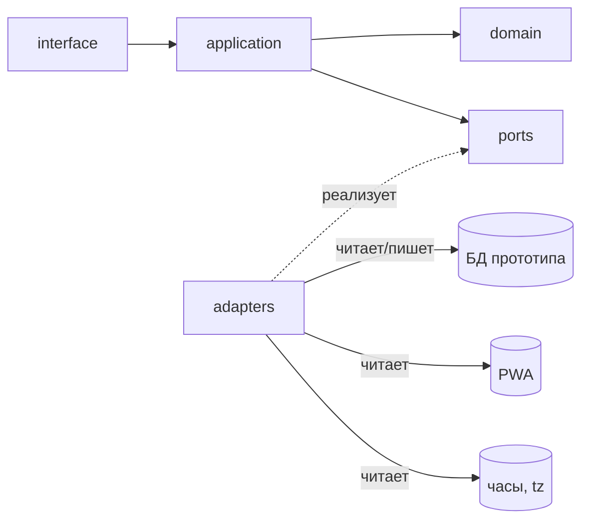
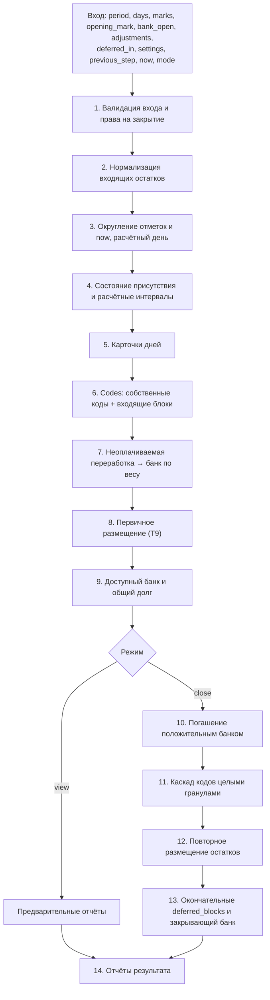
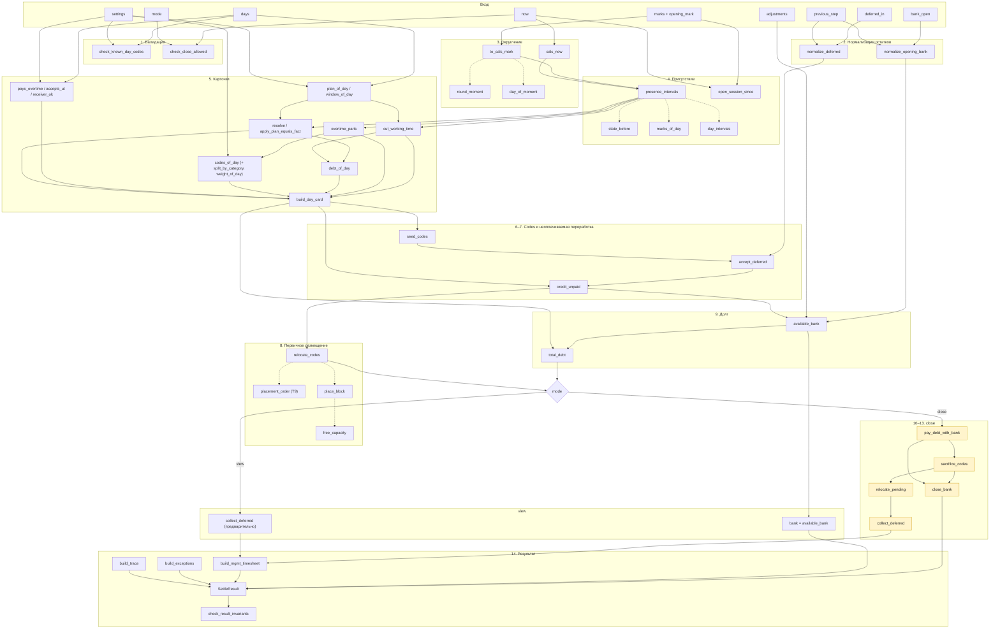
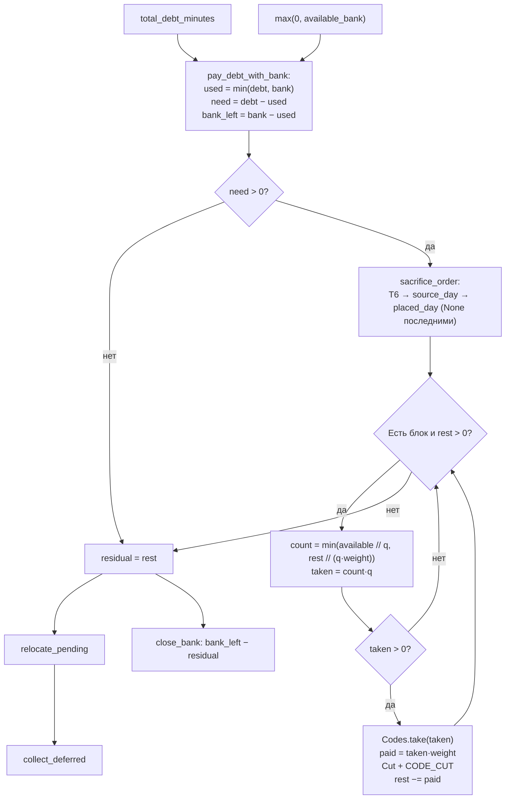

# Учёт переработок и банк часов — спецификация (v4, финальная)

## 0. Назначение и критерий готовности

Документ описывает расчёт часов, переработок, банка часов и управленческого табеля (УТ), а также отдельный расчёт информационных флагов по Графику. Спецификация самодостаточна: всё, что здесь написано, нормативно; всё, что не написано, не реализуется.

Реализация — на Python, набором небольших функций и модулей с физическим разделением слоёв `domain`, `application`, `ports`, `adapters`, `interface` (чистая архитектура). В домене нет побочных эффектов, чтения системного времени, обращений к БД/HTTP/ФС и человекочитаемого форматирования.

**Критерий готовности:**

1. Все приёмочные примеры Ф1–Ф39 воспроизводятся автотестами цифра в цифру.
2. Все инварианты И1–И19 проверяются в моменты, указанные в 10.1, на каждом прогоне; И10 — свойством тестов.
3. Слои физически разделены пакетами; `domain` не импортирует `application`, `adapters`, `interface`.
4. В домене нет `datetime.now()`, `date.today()`, `print`, `logging`; время передаётся параметром `now`.
5. Поведение определяется справочниками и настройками, а не ветвлением по строковым кодам внутри `domain`.
6. Каждая функция соответствует правилу «одно действие»; исключения — композиционные `settle()` и `evaluate_flags()`.
7. Валидация конфигурации запускается при загрузке настроек и сообщает все найденные нарушения разом.
8. Повторный расчёт на одних и тех же сырых данных детерминирован и даёт идентичный результат.

### 0.1 Указания AI-агенту, выполняющему реализацию

Документ написан для AI-агента, который **переписывает расчётный движок внутри уже существующего прототипа веб-приложения**.

1. **Сначала изучи прототип.** Найди: текущий расчётный код, модели данных, источники отметок/Табеля/Графика/банка, места вызова расчёта из UI/API, существующие тесты. Составь карту «что есть → какой слой/порт этой спецификации это заменяет».
2. **Спецификация главнее прототипа.** Если поведение прототипа расходится с документом, верен документ. Не переносить старую логику «как есть», если она противоречит нормам (см. раздел 17 «Миграция прототипа»).
3. **Не менять то, что вне границ системы** (раздел 1.3): UI, кадровые документы, хранение Графика, PWA. Существующие таблицы/модели БД переиспользуются через адаптеры; домен о них не знает.
4. **Порядок работы:** доменные типы и справочники → валидация конфигурации → тесты Ф/И/В (сначала красные) → доменные функции стадиями → `settle()` и `evaluate_flags()` → порты и адаптеры к существующей БД → use case'ы → подключение к существующему интерфейсу → удаление старого движка.
5. **Старый движок удаляется**, а не остаётся параллельной веткой. Допустим временный переключатель на время миграции, но в итоговом коде его нет.
6. **Если норма кажется неполной или противоречивой** — остановиться и задать вопрос владельцу, а не додумывать. Додуманное поведение = ошибка реализации.
7. **Тексты для человека** (подписи флагов, сообщения) собираются только в `interface` по коду и параметрам; домен возвращает данные.

### 0.2 Виды текста в документе

- **Нормативно** — обязательный контракт реализации. Любое отклонение меняет бизнес-логику.
- **Пояснение** — объясняет, зачем правило устроено именно так, но не добавляет обязательств.
- **Пример** — демонстрирует применение нормы и подтверждается автотестом.

Если пояснение и формальное правило расходятся, приоритет имеет формальное правило.

---

## 1. Границы системы

### 1.1 Входные данные

| Источник | Что даёт | Куда идёт |
|---|---|---|
| Табель | код дня + плановые часы на каждый календарный день | расчёт часов, флаги |
| PWA | сырые отметки `момент UTC` + тип `in/out` («пришёл» / «ушёл») | расчёт часов (округлённые), флаги (исходные) |
| График | плановые смены и согласованные отсутствия; хранится отдельно | **только** флаги |
| Модификаторы календарного дня (Т4) | двойные переработки, оплата переработок, `План=Факт`, учёт в УТ | расчёт часов |
| Банк часов | остаток на начало периода + ручные корректировки | расчёт часов |
| Настройки | справочники Т1–Т7, Т9, Т-Группы | расчёт часов, флаги |
| Отложенные блоки (`deferred_in`) | коды УТ, не размещённые в прошлом периоде | расчёт часов |

### 1.2 Выходные артефакты

| Артефакт | Содержание | Кто формирует |
|---|---|---|
| Карточки дней | план, полный факт, рабочее время, переработка, недостача, коды УТ, состояние присутствия | `settle()` |
| Управленческий табель | итоговые коды УТ по дням после размещения и, в `close`, после изъятия | `settle()` |
| Банк часов | остаток на закрытие периода, включая перенос минуса | `settle()` |
| Отложенные блоки (`deferred_blocks`) | коды УТ, для которых в периоде не нашлось приёмника | `settle()` |
| Отчёт об исключениях | структурированные бизнес-ситуации расчёта часов | `settle()` |
| Трассировка | последовательность действий расчёта с причинами и данными | `settle()` |
| Информационные флаги | типизированные флаги по дням (код + параметры) | `evaluate_flags()` |
| Представление дня | карточка дня + её флаги | `application` (склейка) |

### 1.3 Вне системы

Вне системы: расчёт денег, кадровые документы, согласование отпусков, построение и ручное редактирование Графика, UI приложения, валидация последовательности отметок на стороне PWA. Домен доверяет `PunchPort` в части чередования `in/out`; нарушение последовательности — проблема адаптера или источника.

---

## 2. Архитектурные законы

### 2.1 Слои и направление зависимостей

```
interface     → знает только application
application   → знает domain и ports
ports         → контракты доступа к данным и сохранению (Protocol)
domain        → чистое ядро, не знает никого
adapters      → реализуют ports поверх существующей БД/PWA/часов прототипа
```



* `domain` не импортирует `application`, `ports`, `adapters`, `interface`.
* `ports` содержит только `Protocol` и импортирует доменные типы.
* `application` — единственное место, где данные собираются из портов, передаются в `domain`, а результаты сохраняются.
* В `domain` нет побочных эффектов: только «данные → данные».
* Домен состоит из **двух независимых расчётов**: `settle()` (часы, банк, УТ) и `evaluate_flags()` (информационные флаги). Друг друга они не вызывают.

### 2.2 Одна функция — одно действие

| Признак | Формулировка |
|---|---|
| Имя | один глагол без «и»: `cut_working_time`, `find_receiver`, `round_moment` |
| Уровень | либо вычисления, либо вызов других функций — не смешивать |
| Размер | до ~20 строк |
| Вложенность | ≤ 2 уровней (`for` → `if`) |
| Знания | получает всё параметрами, возвращает значение; не знает, кто её вызвал |
| Состояние | не читает и не пишет глобальное, не мутирует аргументы |
| Циклы | один цикл — допустимо; два разных цикла — две функции |
| Побочные эффекты | запрещены (кроме адаптеров) |

**Композиция вместо длинных функций:**

```python
def build_day_card(day, intervals, st, state):
    window = window_of_day(day, st)
    fact   = fact_of_day(intervals)
    plan   = apply_plan_equals_fact(day, fact, plan_of_day(day, st), state, st)
    work   = cut_working_time(intervals, window, plan, st)
    parts  = overtime_parts(intervals, window, plan, st)
    debt   = debt_of_day(plan, work)
    codes  = codes_of_day(day, parts, st)
    return DayCard(...)
```

Длинные функции-сценарии — только `settle()` и `evaluate_flags()`; каждая их строка — вызов одной стадии.

**Проверка на здравый смысл:** если название стадии звучит как существительное верхнего уровня (`Карточки`, `Размещение`, `Каскад`, `Флаги`), внутри неё должно быть несколько маленьких функций. Если функцию нельзя объяснить одной фразой — её нужно разрезать.

### 2.3 Поведение из справочников, а не из веток

Разрешены только три вида условий:

1. защита от структурно невозможных данных (`if interval.is_empty(): return 0`);
2. чтение значения из справочника (`st.day_code_policy[code].accepts_ut`);
3. арифметика и сравнение чисел.

❌ `if day.code in ("ДО", "ОТ", "Б", "НБ", "НН"): return False`
✅ `return st.day_code_policy[day.code].accepts_ut`

❌ `auto = day.code == "К" or group == "Пятидневка"`
✅ `auto = st.day_code_policy[day.code].plan_equals_fact_auto or st.groups[group].plan_equals_fact_auto`

Новое требование («введём код ДК», «праздники удваиваются», «изменим порядок списания») реализуется строкой справочника, а не правкой функций.

### 2.4 Чистота домена

* Нет `datetime.now()` / `date.today()`. «Сейчас» приходит параметром `now`.
* Нет чтения БД, файлов, сети, переменных окружения.
* Нет форматирования строк для человека: флаги, исключения, трасса — код + параметры.
* Нет `print` / `logging`. Диагностика — через возвращаемую трассировку.
* Тайм-зона приходит параметром (`tz`), не берётся из ОС.

### 2.5 Неизменяемость

Все структуры данных — `@dataclass(frozen=True)`. Изменение = новое значение через `dataclasses.replace`. Единственное исключение — аккумулятор кодов УТ `Codes` внутри `settle()` с методами `add` / `take` / `place` / `get`; он не выходит наружу.

### 2.6 Порты

Объявляются в пакете `ports`, реализуются в `adapters`. Домен не знает, откуда берутся данные.

```python
class TimesheetPort(Protocol):
    def days(self, employee_id: str, period: Period) -> Sequence[Day]: ...

class PunchPort(Protocol):
    def marks_between(self, employee_id: str,
                      from_utc: datetime, to_utc: datetime) -> Sequence[Mark]: ...
    def last_mark_before(self, employee_id: str,
                         at_utc: datetime) -> Mark | None: ...

class ShiftPort(Protocol):          # График: смены
    def shifts(self, employee_id: str, period: Period) -> Sequence[Shift]: ...

class AbsencePort(Protocol):        # График: согласованные отсутствия
    def absences(self, employee_id: str, period: Period) -> Sequence[Absence]: ...

class BankPort(Protocol):
    def opening(self, employee_id: str, period: Period) -> Minutes: ...
    def adjustments(self, employee_id: str, period: Period) -> Sequence[Adjustment]: ...

class SettingsPort(Protocol):
    def load(self, period: Period) -> Settings: ...
```

Нормативно:

* `SettingsPort` разрешает настройки по сроку их действия для запрошенного периода, включая ретроспективные исправления. Расчёт использует неизменяемый набор разрешённых настроек; с результатом сохраняются идентификаторы их версий. Календарные переопределения разрешаются для каждой даты.
* Шаг расчёта един для всего периода; смена шага допускается только на границе периодов. Для первого периода без предшественника `previous_step_minutes` равен текущему шагу.
* **График не входит в `Settings`.** Он читается через `ShiftPort` и `AbsencePort` и передаётся только в `evaluate_flags()`. Построение Графика из Табеля и его ручное изменение выполняются вне расчётного ядра; домен получает уже актуальный График.
* Правило выборки отметок `PunchPort` — раздел 7.4.

### 2.7 Трассируемость

Каждое действие, меняющее результат, оставляет запись `Reason(step, code, data)`: нормализация входящего остатка, зачисление переработки в банк, размещение блока, погашение банком, изъятие кода, перенос остатка.

Каждое изъятие — запись `Cut` с датой происхождения, датой размещения либо `None`, тарифом, снятыми физическими минутами и погашенными минутами долга. Снятые физические минуты кратны текущему шагу.

Реестры кодов фиксированы (6.2 — `Reason`, 6.7 — флаги); свободный текст в домене не формируется.

### 2.8 Ошибки и доверие к источнику

* Домен бросает типизированные исключения:
  * `ConfigError` — противоречивая или неполная конфигурация (нарушения В1–В10, В-Гр, В-Отс; отсутствие строки в справочнике);
  * `UnknownDayCodeError` — код дня Табеля отсутствует в Т1;
  * `IncompletePeriodError` — `close` запрошен раньше 00:00 дня, следующего за `period.end`, в часовом поясе расчёта, по **исходному** `now`;
  * `InvariantViolationError(code, data)` — нарушен инвариант; это ошибка реализации, а не бизнес-ситуация. Расчёт прерывается, результат не сохраняется.
* Никаких `-1`, `None`-как-ошибка, проглатывания исключений.
* Бизнес-ситуации (отсутствие приёмника и т. п.) не прерывают расчёт и возвращаются структурированными записями.
* **Домен доверяет источнику отметок** в части последовательности: чередование «пришёл»/«ушёл» корректно, «пришёл» не открывается повторно, «ушёл» не закрывается дважды, отметок позже `now` нет. При нарушении поведение не определено; валидация — ответственность адаптера и PWA.
* `PunchPort` передаёт только UTC-aware `datetime`; naive datetime — ошибка адаптера.

### 2.9 Раскладка по файлам

Каждая функция — в своём файле. Dataclass-структуры объединяются в модули. Каталог функций — раздел 8; дерево проекта — раздел 16. Если в прототипе принята иная структура каталогов, сохраняется **разделение слоёв и пакетов по стадиям**; имена корневых каталогов можно адаптировать к прототипу.

---

## 3. Формальные контракты данных

### 3.1 Базовые типы

| Тип | Смысл |
|---|---|
| `EmployeeId = str` | идентификатор сотрудника |
| `Minutes = int` | целые минуты |
| `StepMinutes = int` | шаг расчёта в целых минутах; атомарная гранула кода УТ |
| `DayId = date` | календарный день в `tz` (по умолчанию `Europe/Moscow`) |
| `Moment = datetime` | момент времени в UTC, timezone-aware |
| `Mode = Literal["view", "close"]` | режим расчёта |
| `PresenceState = Literal["open", "closed"]` | состояние присутствия: сессия открыта / закрыта |

### 3.2 Доменные сущности

```python
@dataclass(frozen=True)
class Period:
    start: date
    end: date

@dataclass(frozen=True)
class Day:
    day: date
    code: str
    plan_minutes: Minutes
    employee_id: str
    group: str

@dataclass(frozen=True)
class Mark:
    employee_id: str
    at_utc: datetime                  # исходный момент из PWA
    kind: Literal["in", "out"]

@dataclass(frozen=True)
class CalcMark:                       # расчётное представление отметки
    source: Mark                      # связь с исходной отметкой сохраняется
    at_calc: datetime                 # округлённый момент
    day: date                         # расчётный день (после округления и правила полуночи)

@dataclass(frozen=True)
class Interval:                       # полуинтервал [start, end) внутри одного дня
    day: date
    start_minute: Minutes             # 0..1440
    end_minute: Minutes               # 0..1440

@dataclass(frozen=True)
class Shift:                          # смена Графика, может пересекать полночь
    employee_id: str
    start_utc: datetime
    end_utc: datetime

@dataclass(frozen=True)
class Absence:                        # согласованное отсутствие Графика
    employee_id: str
    day: date
    start_minute: Minutes
    end_minute: Minutes

@dataclass(frozen=True)
class Adjustment:
    amount_minutes: Minutes           # знаковое, в минутах банка
    reason_code: str
    note: str | None = None

@dataclass(frozen=True)
class DeferredBlock:
    source_day: date
    tariff: str
    minutes: Minutes                  # физические минуты, > 0, кратны шагу
    reason_code: str

@dataclass(frozen=True)
class Reason:
    step: str
    code: str
    data: Mapping[str, object]

@dataclass(frozen=True)
class Flag:
    day: date
    code: str                         # из реестра 6.7
    data: Mapping[str, object]        # параметры, например expected_return

@dataclass(frozen=True)
class Cut:
    source_day: date
    placed_day: date | None
    tariff: str
    taken_minutes: Minutes
    paid_minutes: Minutes

@dataclass(frozen=True)
class DayCard:
    day: date
    timesheet_value: str
    plan_minutes: Minutes
    full_fact_minutes: Minutes
    work_minutes: Minutes
    overtime_minutes: Minutes
    debt_minutes: Minutes
    codes: Mapping[str, Minutes]      # собственные коды дня до снятия/переноса
    pays_overtime: bool               # итоговый признак оплаты переработки дня (5.2)
    open_at_start: bool               # расчётная сессия открыта в 00:00
    open_at_end: bool                 # расчётная сессия открыта в 24:00
    plan_equals_fact_applied: bool

@dataclass(frozen=True)
class SettleResult:
    cards: tuple[DayCard, ...]
    mgmt_timesheet: Mapping[date, Mapping[str, Minutes]]
    bank_open_minutes: Minutes
    bank_open_normalized_minutes: Minutes
    bank_adjustments_minutes: Minutes
    bank_closed_minutes: Minutes
    credited_to_bank_minutes: Minutes
    paid_with_bank_minutes: Minutes
    total_debt_minutes: Minutes
    residual_debt_minutes: Minutes
    cuts: tuple[Cut, ...]
    deferred_blocks: tuple[DeferredBlock, ...]
    open_session_since_utc: datetime | None   # исходный момент «пришёл» незакрытой сессии
    exceptions: tuple[Reason, ...]
    trace: tuple[Reason, ...]

@dataclass(frozen=True)
class FlagsResult:
    flags: tuple[Flag, ...]
```

Поле `invariant_errors` из v3 удалено: нарушение инварианта — исключение `InvariantViolationError` (2.8).

Нормативно:

* `DeferredBlock.minutes` хранит физические минуты кода УТ. На выходе периода величина положительна и кратна шагу периода. При смене шага входящие блоки нормализуются к новому шагу до размещения и каскада (4.6). Блоки, округлённые до нуля, исключаются.
* `Adjustment.amount_minutes` знаковое; единица — минуты банка.
* `Cut.source_day` — историческая дата происхождения кода; `Cut.placed_day` — дата размещения в текущем периоде; `None` — изъятие неразмещённого блока. Размещение не меняет `source_day` и `tariff`.
* `Flag.data` содержит моменты как UTC-aware `datetime` или минуты локального дня; форматирование — в `interface`.

### 3.3 Правила форматов

* `Day.plan_minutes` хранится отдельно; значение Табеля (`"Я 12"`, `"В"`, `"Н 4"`) вычисляется `value_of(day, st)`.
* Все моменты `Mark.at_utc` хранятся в UTC; календарный день определяется после округления и перевода в `tz`.
* `Adjustment` применяется агрегированно на уровне периода.
* `Period` — произвольный непрерывный диапазон дат (`start <= end`). Понятие «следующий период» определяется в `application`.

### 3.4 Семантика полей результата

| Поле | Смысл | Порядок / полнота |
|---|---|---|
| `cards` | Карточки календарных дней периода | по возрастанию `day`, по одной на каждый день Табеля |
| `mgmt_timesheet` | Итоговые коды УТ по дням после размещения и, в `close`, после изъятия | только итоговое состояние |
| `bank_open_minutes` | Исходный остаток банка на входе | как получен из `BankPort` |
| `bank_open_normalized_minutes` | Остаток после нормализации к шагу | при неизменном шаге равен исходному |
| `bank_adjustments_minutes` | Сумма ручных корректировок | агрегированно |
| `bank_closed_minutes` | Итоговый банк | согласован с И8 и И15 |
| `credited_to_bank_minutes` | Зачислено в банк из неоплачиваемых переработок | взвешенные минуты |
| `paid_with_bank_minutes` | Погашено банком | 1:1 к долгу |
| `total_debt_minutes` | Σ дневных недостач + отрицательная часть доступного банка | до погашения |
| `residual_debt_minutes` | Недостача, не погашенная ни банком, ни кодами | уходит минусом банка |
| `cuts` | Изъятия кодов | в порядке каскада |
| `deferred_blocks` | Оставшиеся неразмещённые блоки | в `close` — после каскада и повторного размещения |
| `open_session_since_utc` | Исходный момент «пришёл», если на конец расчётного интервала сессия открыта | иначе `None` |
| `exceptions` | Бизнес-ситуации расчёта часов | стабильный порядок |
| `trace` | Трассировка | в порядке выполнения стадий |

Для `mode="view"`:

* `total_debt_minutes` вычисляется так же, как в `close`;
* `paid_with_bank_minutes = 0`, `cuts` пуст;
* `residual_debt_minutes = total_debt_minutes` — долг до погашения;
* `bank_closed_minutes = available_bank` — предварительный банк;
* `deferred_blocks` предварительные;
* результат не сохраняется.

---

## 4. Предметная модель

### 4.1 Две валюты

| Валюта | Что в ней измеряется | Перевод |
|---|---|---|
| **Физические часы** (`Minutes`) | план, факт, рабочее время, переработка, коды УТ | — |
| **Часы банка** (взвешенные) | банк, недостача | физические × вес кода |

Правила обмена (осознанная асимметрия):

* **Начисление недостачи — 1:1**, без веса дня.
* **Погашение недостачи кодом — по весу кода**: 1 ч `ДЯ 2` гасит 2 ч недостачи.
* **Зачисление неоплаченной переработки в банк — по весу кода**: 12 ч `ДЯ 2` = 24 ч банка. Это постоянное правило, не настройка.
* **Погашение недостачи банком — 1:1.**

Следствие: в редком случае «двойные переработки + недостача в тот же день» система чуть переплачивает сотруднику. Это принято намеренно.

### 4.2 Определения

| Термин | Определение |
|---|---|
| **Отметка** | `Mark(момент, тип)`: момент UTC + «пришёл» \| «ушёл». Тип задаёт источник (PWA), расчёт его не восстанавливает |
| **Расчётная отметка** | `CalcMark`: исходная отметка + округлённый момент + расчётный день |
| **Состояние присутствия** | `open` — последняя отметка «пришёл», сессия открыта; `closed` — последняя «ушёл» или отметок нет |
| **Интервал присутствия** | отрезок `[начало, конец)` внутри одного календарного дня, в котором сотрудник присутствует |
| **Синтетическая граница** | 00:00 или 24:00, ограничивающие интервал при открытой сессии; не является реальной отметкой |
| **Полный факт дня** | сумма длин расчётных интервалов присутствия дня |
| **Окно** | стандартное окно рабочего времени из Т2 по **значению Табеля** («Я 12» → 08:00–20:00) |
| **Рабочее время** | полный факт ∩ окно |
| **Переработка** | полный факт − рабочее время |
| **План** | часы из Табеля; 0 для кодов без часов |
| **Недостача дня** | `max(0, план − рабочее время)`. Всегда ≥ 0 |
| **Категория времени** | дневные (06:00–22:00) или ночные (22:00–06:00) часы — Т3 |
| **Код УТ** | категория + вес дня: `ДЯ`, `ДН`, `ДЯ 2`, `ДН 2` |
| **Оплачиваемость дня** | итоговый признак `pays_overtime(day)` (5.2): переработка дня идёт в УТ или в банк |
| **Приёмник** | день, в который можно разместить перенесённый блок (5.2) |
| **УТ** | итоговые коды УТ по дням после размещения и изъятия |
| **Банк часов** | остаток взвешенных часов; может быть отрицательным |
| **Изъятие** | снятие целых гранул кода УТ в погашение недостачи |
| **Остаток недостачи** | непокрытая часть; всегда переносится в следующий период минусом банка |

**Понятие «сальдо» в модели отсутствует.** Рабочее время всегда ≤ план (гарантировано Т2 и В2); недостача — единственная величина долга в карточке дня.

### 4.3 Календарные дни и перенос состояния присутствия

**Нормативно.** Часы считаются по календарным дням: каждый интервал присутствия лежит внутри одного дня. Через полночь переносится **не сессия, а состояние присутствия**.

Правило построения интервалов (одинаково для расчётных и исходных отметок, см. 4.5):

1. Определить состояние на начало первого дня периода: тип последней отметки, относящейся к более раннему дню (`in` → `open`, `out` → `closed`, отметок нет → `closed`).
2. Обходить дни по порядку. В начале дня, если состояние `open`, интервал начинается в 00:00.
3. Отметки дня обрабатываются по порядку: `in` открывает интервал и ставит `open`; `out` закрывает интервал и ставит `closed`.
4. Если в конце дня состояние `open`, интервал закрывается синтетической границей 24:00 (или концом расчётного времени для текущего дня, 4.4). Состояние `open` переносится на следующий день.
5. Интервалы нулевой длины отбрасываются.

Пример:

| День | Отметки | Состояние на начало | Интервалы |
|---|---|---|---|
| Пн | `in 20:00` | closed | 20:00–24:00 |
| Вт | — | open | 00:00–24:00 |
| Ср | `out 08:00` | open | 00:00–08:00 |

Следствия:

* нет «сменного дня» и «кусков смены»;
* часы после полуночи принадлежат следующему дню; часы через границу периода не переносятся;
* рабочее время дня ≤ плана дня гарантировано конструкцией;
* синтетическая граница 24:00 завершает дневной отрезок, но **не означает реальный уход**;
* для состояния на начало периода достаточно **одной последней отметки перед периодом** (7.4), а не всей истории; начальное состояние вычисляется из данных, а не хранится изменяемым флагом;
* **забытый уход означает непрерывное присутствие.** Сессия автоматически не закрывается; незакрытая сессия видна через `open_session_since_utc` и флаг `SESSION_OPEN`.

### 4.4 Время, часовые пояса, полночь, `now`

* Хранение моментов — **UTC**.
* Календарный день определяется в `tz` (по умолчанию `Europe/Moscow`) — одинаково для всех сотрудников, включая командировочных. `tz` — параметр, не константа.
* `now` передаётся как timezone-aware момент UTC. Naive `datetime` не допускается.

**Соглашение о полуночи.** Отметка «ушёл» ровно в 00:00 принадлежит предыдущему дню (= его 24:00). Отметка «пришёл» ровно в 00:00 принадлежит новому дню.

**Два представления `now`:**

| Представление | Как получается | Где используется |
|---|---|---|
| `now` (исходный) | как передан | локальная дата «сегодня»; право на закрытие периода; флаги |
| `now_calc` | `round_moment(now, step)` — то же правило, что для отметок | конец расчётного интервала текущего дня |

Нормативно:

* «Сегодня» — локальная дата **исходного** `now`.
* Открытый интервал текущего дня заканчивается в `min(now_calc, 24:00)`. Если `now_calc` округлился до следующей полуночи, интервал заканчивается в 24:00 сегодняшнего дня и **не создаёт факт следующего дня**.
* Открытый интервал прошедшего дня заканчивается в 24:00.
* Дни позже «сегодня» не имеют расчётных интервалов: полный факт 0. Карточка такого дня в `view` считается по общим правилам (план из Табеля, недостача = план): это прогноз «если сотрудник больше не придёт». Отдельной ветки для будущих дней нет.
* Поскольку отметок позже `now` не существует (2.8), а округление монотонно, округлённый приход никогда не позже `now_calc`; отрицательных интервалов не бывает. Интервал нулевой длины отбрасывается.
* Закрытие разрешено, только если исходный `now` ≥ 00:00 дня после `period.end`. Округление 23:40 до 00:00 права на закрытие не даёт.

### 4.5 Округление: одно место, одна сетка

**Нормативно.** Округляются только:

1. моменты реальных отметок;
2. `now` (в `now_calc`);
3. входящие остатки при смене шага (4.6).

Длительности (полный факт, рабочее время, переработка, фрагменты категорий) **не округляются**: они получаются вычитанием и суммированием моментов, уже лежащих на сетке шага.

Правило округления момента: до ближайшего кратного шагу относительно локальной полуночи; ровно половина шага — вверх. Шаг делит 60 (В8).

Чтобы длительности автоматически оставались кратными шагу, **все расчётные границы лежат на той же сетке**: границы окон Т2 и категорий Т3 кратны шагу от начала суток (В10). Граница 00:00/24:00 кратна всегда.

Следствие: для каждого дня точно выполняется `полный факт = рабочее время + переработка` (И9), а все величины кратны шагу (И18). Никакого «допуска округления» нет.

**Порядок обработки отметки:**

1. Округлить момент (Р2).
2. Определить день по **округлённому** моменту с учётом соглашения о полуночи.

Пример: `in 23:35` при шаге 60 → `24:00` = `00:00` следующего дня → отметка принадлежит новому дню.

**Исходные и расчётные отметки.** Исходный момент хранится в `CalcMark.source`. Для часов строятся **расчётные интервалы** по округлённым отметкам и `now_calc`. Для флагов строятся **исходные интервалы** по исходным отметкам и исходному `now`, по тому же правилу 4.3. Состояние на начало дня у этих представлений может различаться (например, реальный уход в 00:20 при расчётном 00:00) — это нормально.

График и согласованные отсутствия могут иметь любые минуты: они информационные и расчётные часы не режут.

### 4.6 Нормализация входящих остатков при смене шага

Если шаг нового периода отличается от шага предыдущего, на входе нового периода округляются:

* остаток банка — как один знаковый остаток (положительный банк или перенесённый долг);
* физические минуты **каждого** входящего `DeferredBlock` отдельно (округление суммы запрещено); `source_day` и `tariff` сохраняются; блок, округлённый до нуля, не добавляется.

Округление — до ближайшего кратного новому шагу; ровно половина — вверх по абсолютной величине; знак сохраняется, кроме округления до нуля. При шаге 60: `+15 → 0; +30 → +60; −15 → 0; −30 → −60`.

Нормализация выполняется до зачисления неоплаченной переработки, размещения и погашения. При неизменном шаге не выполняется. Исходные значения не перезаписываются; повторный расчёт использует исходные значения. Каждое изменение фиксируется `OPENING_ROUNDED` (исходное, новое, старый шаг, новый шаг, разница).

### 4.7 Роль Графика

График — плановый документ, **хранится отдельно** (вне `Settings`), строится и редактируется вне расчётного ядра. Он **не участвует в расчёте часов**: план, факт, рабочее время, переработка, категории, коды УТ, лимит 24 ч, банк и каскад считаются только по Табелю, отметкам и настройкам. График используется **только** в `evaluate_flags()`.

```text
Табель + отметки + банк + настройки + deferred_in
    → settle()          → часы, переработки, банк, УТ, переносы

График (смены + отсутствия) + исходные интервалы + Табель + исходный now
    → evaluate_flags()  → информационные флаги
```

`application` склеивает результаты в представление дня. **Изменение Графика пересчитывает только флаги** и не меняет числовой результат.

| Сущность Графика | Что это | Порт |
|---|---|---|
| **Смена** | ожидаемый рабочий отрезок; может пересекать полночь | `ShiftPort` |
| **Согласованное отсутствие** | интервал(ы) внутри дня, когда сотрудника быть не должно | `AbsencePort` |

**Нормализация смены через полночь.** Смена `20:00–08:00` до расчёта флагов раскладывается на календарные отрезки: день D `20:00–24:00`, день D+1 `00:00–08:00`. Более длинные смены — по тому же правилу. Каждый отрезок существует только внутри своего дня (И16).

**Согласованные отсутствия:** на день может быть несколько интервалов; пересекающиеся и примыкающие сливаются. Отсутствия вычитаются из дневного отрезка смены → **ожидаемые подинтервалы**. Если подинтервалов не осталось, сотрудник в этот день не ожидается.

Правила флагов — раздел 6.7.

### 4.8 Табель и График независимы. Долг как часть периода

Табель определяет план, окно и наличие долга. График определяет только флаги. Штатная ситуация — дневной Табель при ночной смене в Графике: долг дня и переработка той же ночи — **независимые части одного периода**. Расхождение Табеля и Графика не является ошибкой и не порождает флагов.

**Долг дня не привязан к переработке конкретного дня.** Он входит в общий долг периода и гасится в порядке:

1. положительный банк (входящий + корректировки + зачисленные неоплаченные);
2. коды УТ по очереди Т6 (`ДЯ` → `ДН` → `ДЯ 2` → `ДН 2`);
3. внутри тарифа — по возрастанию `source_day`.

Отрицательный банк не является источником погашения — он представляет переносимый долг.

```
available_bank     = bank_open_normalized_minutes + bank_adjustments_minutes + credited_to_bank_minutes
day_debt           = Σ дневных недостач
total_debt_minutes = day_debt + max(0, -available_bank)
положительный банк = max(0, available_bank)
```

Отрицательная часть `available_bank` включается в долг ровно один раз и повторно при закрытии не вычитается.

**Перенос кодов — только вперёд.** Назад не переносим: это вторгалось бы в закрытые периоды.

---

## 5. Конфигурация

Все таблицы — данные справочников, загружаемые через `SettingsPort`. Значения в таблицах — стартовое наполнение.

### Т1. Типы кодов Табеля

| Код | Несёт плановые часы | Принимает коды УТ | Учитывается в УТ | План=Факт Авто | Активность требует проверки |
|---|---|---|---|---|---|
| Я | Да | Да | Да | Нет | Нет |
| К | Да | Да | Да | **Да** | Нет |
| В | Нет | Да | Да | Нет | Нет |
| ДО | Нет | Нет | Да | Нет | Да |
| ОТ | Нет | Нет | Да | Нет | Да |
| ОВ | Нет | Нет | Да | Нет | Да |
| Б | Нет | Нет | Нет | Нет | Да |
| НБ | Нет | Нет | Нет | Нет | Да |
| НН | Нет | Нет | Нет | Нет | Да |

Коды добавляются строкой. Смысл колонок:

* **Принимает коды УТ** — разрешение по типу дня держать коды УТ в своей строке УТ (свои и перенесённые).
* **Учитывается в УТ** — значение по умолчанию для признака «переработка дня оплачивается через УТ»; переопределяется в Т4.
* **План=Факт Авто** — для значения, несущего часы, модификатор `План=Факт = Авто` разрешается в «Да».
* **Активность требует проверки** — каждая реальная отметка такого дня получает информационный флаг `ACTIVITY_REQUIRES_REVIEW`. Не влияет на расчёт и не блокирует закрытие. Синтетические границы не помечаются.

### Т2. Стандартные окна рабочего времени

Ключ — **значение Табеля** (код + плановые часы).

| Значение Табеля | Начало | Конец | Длина |
|---|---|---|---|
| Я 12 | 08:00 | 20:00 | 12 ч |
| Я 9 | 09:00 | 18:00 | 9 ч |
| Я 8 | 09:00 | 17:00 | 8 ч |
| К 12 | 08:00 | 20:00 | 12 ч |
| К 9 | 09:00 | 18:00 | 9 ч |
| К 8 | 09:00 | 17:00 | 8 ч |

Для значений без часов окна нет: всё отработанное — переработка. Каждое значение Табеля с часами имеет строку на каждое встречающееся значение часов. Ночные смены добавляются так же: `Н 4` (20:00–24:00), `Н 8` (00:00–08:00). Границы окон кратны шагу (В10).

### Т3. Категории времени

| Категория | Начало | Конец |
|---|---|---|
| Дневные часы (ДЯ) | 06:00 | 22:00 |
| Ночные часы (ДН) | 22:00 | 06:00 |

Категории покрывают сутки без дыр и перекрытий; границы кратны шагу (В10).

### Т4. Модификаторы календарного дня

| Модификатор | Значения | Действие |
|---|---|---|
| Двойные переработки | Да / Нет | вес часа переработки = 2 |
| Оплачиваются ли переработки | Да / Нет | участвует в `pays_overtime` (5.2) |
| План=Факт | Да / Нет / Авто | см. ниже |
| Учитываются ли часы в УТ | Да / Нет | переопределяет «Учитывается в УТ» из Т1; участвует в `pays_overtime` |

**Модификатора «Праздничный день» нет.** Удвоение в дату — переопределение `Двойные переработки = Да`.

**План=Факт.** `Авто` разрешается в «Да», если значение Табеля несёт часы и в Т1 для кода `План=Факт Авто = Да`, **либо** у группы сотрудника в Т-Группы `План=Факт Авто = Да`. Иначе `Авто = Нет`. Модификатор применяется, только если в дне **нет фактического присутствия**: нет реальных расчётных отметок дня и расчётное состояние на начало дня `closed`. Тогда план := 0, недостачи нет.

**Приоритет разрешения модификатора** (от сильного к слабому):

1. сотрудник + день
2. сотрудник + период
3. группа + день
4. группа + период
5. все сотрудники + день
6. все сотрудники + период
7. значение по умолчанию из Т1–Т2

### Т5. Веса кодов УТ

| Код УТ | Вес |
|---|---|
| ДЯ | 1 |
| ДН | 1 |
| ДЯ 2 | 2 |
| ДН 2 | 2 |

План и рабочее время не взвешиваются.

### Т6. Очередность погашения недостачи (каскад)

| № | Источник |
|---|---|
| 1 | Банк часов |
| 2 | ДЯ |
| 3 | ДН |
| 4 | ДЯ 2 |
| 5 | ДН 2 |

Сначала самое дешёвое для сотрудника. Внутри тарифа — по возрастанию `source_day`. Т6 определяет **только каскад**; порядок размещения задаётся отдельно в Т9.

### Т6.1 Неделимость гранулы кода

Атомарная единица кода УТ — один шаг `q` в физических минутах. Изымается только целое число гранул; изъятие никогда не перекрывает остаток долга.

```
число гранул = min(available // q, rest // (q * weight))
снято        = число гранул * q
погашено     = снято * weight
```

Если одна гранула по весу дороже остатка долга, изъятие равно нулю: код остаётся сотруднику, долг переносится минусом банка. Остаток долга внутри периода не округляется.

### Т7. Округления и лимиты

| Параметр | Значение | Смысл |
|---|---|---|
| Шаг расчёта | 60 мин | округление отметок и `now`; сетка границ Т2/Т3; гранула кода УТ; нормализация остатков |
| Лимит опоздания | 5 мин | допуск для флагов `LATE` / `EARLY_DEPARTURE` |
| Лимит часов в календарном дне | 24 ч | план + Σ кодов УТ дня ≤ 24 |

### Т8. Удалена

Таблица «Флаги поведения» из v3 удалена:

* «Остаток недостачи переносится» — удалён; перенос остатка минусом банка — постоянный закон.
* «Зачисление в банк по весу» — удалён; зачисление по весу — постоянный закон (4.1).
* «Режим расчёта» — не настройка, а параметр `mode` вызова.

### Т9. Порядок размещения кодов

| Параметр | Значение | Изменяемость |
|---|---|---|
| Порядок тарифов при одинаковой дате происхождения | ДЯ → ДН → ДЯ 2 → ДН 2 | **настраивается** (список всех кодов Т5 без повторов, В11); хранится отдельно от Т6 |
| Приоритет собственных кодов дня | собственные коды принимающего оплачиваемого дня остаются в своём дне и занимают ёмкость раньше переносов | закон |
| Порядок переносимых блоков | по возрастанию `source_day`, затем по порядку тарифов Т9 | закон |
| Объединение блоков | блоки с одинаковыми `source_day` и `tariff` объединяются перед размещением | закон |
| Выбор приёмника | ближайший допустимый день строго после `source_day` со свободной ёмкостью | закон |
| Частичное размещение | блок заполняет доступную ёмкость приёмника, остаток ищет следующий приёмник | закон |
| Направление | только вперёд; в пределах периода | закон |
| Ёмкость | план + Σ кодов дня ≤ лимита Т7 | закон |

Изменение Т6 не меняет размещение, изменение Т9 не меняет каскад.

### Т-Группы. Группы сотрудников

| Группа | Назначение | План=Факт Авто |
|---|---|---|
| Смена 1 | Первая смена | Нет |
| Смена 2 | Вторая смена | Нет |
| Пятидневка | Пятидневная рабочая неделя | **Да** |

Сотрудник принадлежит ровно одной группе. Группы добавляются строкой.

### 5.1 Согласованные отсутствия (данные Графика)

Задаются вне ядра на пару `(сотрудник, дата)`; один или несколько интервалов `HH:MM–HH:MM` внутри календарного дня. Пересекающиеся и примыкающие сливаются. Читаются через `AbsencePort`, используются только флагами.

### 5.2 Оплачиваемость дня и допустимый приёмник

Нормативно, для каждого дня D с разрешёнными на D настройками:

```
counts_in_ut(D)  = Т4 «Учитываются ли часы в УТ» (по приоритету) либо Т1 «Учитывается в УТ»
pays_overtime(D) = counts_in_ut(D) И Т4 «Оплачиваются ли переработки»(D)
accepts_ut(D)    = Т1 «Принимает коды УТ»
receiver_ok(D)   = accepts_ut(D) И pays_overtime(D)
```

Судьба **собственной** переработки дня D решается по дню происхождения:

| `pays_overtime(D)` | `accepts_ut(D)` | Что происходит с кодами дня | Пример |
|---|---|---|---|
| Нет | любое | зачисляются в банк по весу (`credit_unpaid`); в УТ не попадают | `В` с «Учитываются в УТ = Нет»; `Б` |
| Да | Да | остаются в своём дне УТ | `Я`, `В` |
| Да | Нет | переносятся вперёд в допустимый приёмник | `ОТ`, `ДО` |

**Чужой (переносимый) блок** размещается только в день с `receiver_ok = Да`. День, исключённый из УТ или с неоплачиваемой переработкой, **пропускается**; блок не превращается в банк. Способ компенсации определяется днём происхождения; размещение его не меняет.

Входящие `deferred_in` уже прошли это решение в своём периоде и повторно в банк не зачисляются.

### 5.3 Валидация конфигурации

Запускается при загрузке настроек. Каждое правило — отдельная функция, возвращающая список нарушений; все нарушения сообщаются сразу (`ConfigError`).

| № | Правило |
|---|---|
| В1 | Каждое значение Табеля, несущее часы, имеет строку в Т2 |
| В2 | Длина окна Т2 равна плановым часам значения |
| В3 | Окно не пустое, начало ≠ конец, границы в пределах суток |
| В4 | Категории Т3 покрывают сутки без дыр и перекрытий |
| В5 | Для каждой категории Т3 и каждого веса определён код УТ, присутствующий в Т5 |
| В6 | Т6 содержит все коды Т5, без повторов |
| В7 | Все веса Т5 > 0 |
| В8 | Шаг расчёта делит 60 без остатка |
| В9 | Для кода, не несущего часы, плановые часы не заданы |
| В10 | Все границы окон Т2 и категорий Т3 кратны шагу расчёта от начала суток |
| В11 | Порядок тарифов Т9 содержит все коды Т5, без повторов |
| В-Гр1 | У каждого сотрудника ровно одна группа |
| В-Гр2 | Группа из привязки сотрудника существует в Т-Группы |

Проверки данных Графика (`ShiftPort`, `AbsencePort`) — ответственность адаптеров:

| № | Правило |
|---|---|
| В-Отс1 | Начало < конец у каждого согласованного отсутствия |
| В-Отс2 | Интервал отсутствия лежит внутри календарного дня |
| В-См1 | У смены начало < конец |

---

## 6. Конвейеры расчёта

### 6.1 Обзор

В домене два независимых конвейера:

* **`settle()`** — часы, коды УТ, размещение, банк, каскад, переносы. Не получает График.
* **`evaluate_flags()`** — информационные флаги. Не меняет ни одного числа.

Идея `settle()`:

1. проверить вход и нормализовать входящие остатки;
2. округлить отметки и `now`, распределить по дням, вычислить состояние присутствия;
3. построить расчётные интервалы и карточки дней;
4. собрать коды УТ, зачислить неоплачиваемые в банк, разместить переносимые;
5. только в `close` — погасить долг банком и каскадом, повторно разместить остатки;
6. собрать отчёты; инварианты проверяются на стадиях.



### 6.2 Реестр кодов `Reason` (расчёт часов)

| Код | Смысл | Стадия | Куда | Минимальный состав `data` |
|---|---|---|---|---|
| `OPENING_ROUNDED` | входящий остаток нормализован при смене шага | opening | trace | `kind`, `before_minutes`, `after_minutes`, `delta_minutes`, `old_step_minutes`, `new_step_minutes`; для блока также `source_day`, `tariff` |
| `PLAN_EQUALS_FACT` | применён модификатор План=Факт | cards | trace | `day`, `plan_before`, `plan_after`, `policy` |
| `UNPAID_CREDITED` | неоплачиваемая переработка зачислена в банк | credit_unpaid | trace | `day`, `tariff`, `taken_minutes`, `credited_minutes` |
| `CODE_PLACED` | блок (или его часть) размещён в приёмник | placement / replacement | trace | `source_day`, `placed_day`, `tariff`, `minutes`, `pass` (`primary` \| `after_cascade`) |
| `NO_RECEIVER` | для блока не найден приёмник | deferred | exceptions | `source_day`, `tariff`, `minutes` |
| `BANK_APPLIED` | часть долга погашена банком | bank | trace | `before`, `used`, `after`, `debt_before`, `debt_after` |
| `CODE_CUT` | код УТ изъят каскадом | cascade | trace | `source_day`, `placed_day`, `tariff`, `taken_minutes`, `paid_minutes` |
| `RESIDUAL_CARRIED` | непогашенный остаток перенесён в минус банка | closing | trace | `residual_minutes`, `bank_before`, `bank_after` |

Нормативно:

* В `close` `NO_RECEIVER` формируется только для окончательных остатков после каскада и повторного размещения; в `view` — для предварительных.
* `CAP_VIOLATION` из v3 удалён: превышение лимита дня не бизнес-ситуация, а нарушение И6 → `InvariantViolationError`.
* `ACTIVITY_REQUIRES_REVIEW`, `MISSED_DAY`, `OFF_SHIFT_ATTENDANCE` перенесены в реестр флагов (6.7).
* Свободный текст в `Reason` не допускается. `data` может содержать дополнительные поля; перечисленные ключи обязательны и образуют контракт с `interface` и тестами.

### 6.3 Стадии `settle()`

#### Стадия 1. Валидация входа

* `check_known_day_codes(days, st)` — каждый код дня есть в Т1, иначе `UnknownDayCodeError`.
* `check_close_allowed(period, now, mode, tz)` — для `close` исходный `now` ≥ 00:00 дня после `period.end`, иначе `IncompletePeriodError`.

#### Стадия 2. Нормализация входящих остатков

* `normalize_opening_bank(value, old_step, new_step)` — знаковый остаток банка.
* `normalize_deferred(blocks, old_step, new_step)` — каждый блок отдельно.

Выход: нормализованный банк, нормализованные блоки, записи `OPENING_ROUNDED`.

#### Стадия 3. Округление и расчётный день

* `round_moment(t, step, tz)` — округлить момент по сетке от локальной полуночи; половина — вверх.
* `day_of_moment(t, kind, tz)` — календарный день с учётом соглашения о полуночи.
* `to_calc_mark(mark, st)` — построить `CalcMark`.
* `calc_now(now, st)` — `now_calc`.

На вход подаются все отметки, полученные по правилу 7.4 (с запасом за границами периода), и `opening_mark`. Фильтрации по разрешениям нет.

#### Стадия 4. Состояние присутствия и расчётные интервалы

* `state_before(marks, day)` — тип последней отметки, относящейся к дню раньше `day`; `closed`, если таких нет.
* `marks_of_day(marks, day)` — отметки одного дня в порядке момента (при равенстве — в порядке источника).
* `day_intervals(marks_of_day, state, day, today, end_of_today)` — интервалы дня по правилу 4.3; возвращает интервалы и состояние на конец дня.
* `presence_intervals(period, marks, opening_mark, now_calc, today)` — композиция по всем дням периода; возвращает интервалы, `open_at_start`, `open_at_end` по дням.
* `open_session_since(marks, now)` — исходный момент последнего `in`, если на `now` сессия открыта.

Отметки, относящиеся к дням до `period.start`, только задают начальное состояние; к дням после `period.end` — игнорируются.

Инварианты стадии: И12, И18 (для интервалов).

#### Стадия 5. Карточка дня

**5.1 План и окно**
* `value_of(day, st)`, `plan_of_day(day, st)`, `window_of_day(day, st)`;
* `resolve_plan_equals_fact(day, st)` — разрешить Да/Нет/Авто по Т1, Т-Группы, Т4;
* `apply_plan_equals_fact(day, fact, plan, has_presence, st)` — план := 0, если модификатор «Да» и присутствия в дне нет.

**5.2 Рабочее время и переработка**
* `fact_of_day(intervals)` — сумма длин интервалов;
* `cut_working_time(intervals, window)` — пересечение с окном; при `План=Факт` рабочее время = план;
* `overtime_parts(intervals, window)` — части интервалов вне окна;
* `debt_of_day(plan, work)` — `max(0, plan − work)`.

**5.3 Категории и коды**
* `category_cuts(interval, st)`, `split_by_category(interval, st)`, `category_of(minute, st)`;
* `classify_overtime(parts, st)` — суммы по категориям;
* `weight_of_day(day, st)` — 1 или 2 по Т4;
* `codes_of_day(day, parts, st)` — категории → коды УТ с учётом веса.

**5.4 Признаки дня**
* `counts_in_ut(day, st)`, `pays_overtime(day, st)`, `accepts_ut(day, st)`, `receiver_ok(day, st)` — по 5.2.

**5.5 Сборка**
* `build_day_card(...)` — композиция.

Инварианты стадии: И1–И5, И9, И18.

#### Стадия 6. Аккумулятор кодов

* `seed_codes(cards, st)` — собственные коды дней в `Codes`. Блок собственного кода принимающего оплачиваемого дня получает `placed_day = source_day`; иначе `placed_day = None`.
* `accept_deferred(deferred_in, codes)` — входящие блоки с `placed_day = None`, `source_day` и `tariff` сохранены.
* `created_totals(codes)` — контрольная сумма физических минут для И17.

#### Стадия 7. Неоплачиваемая переработка

* `credit_unpaid(cards, codes, st)` — для дней с `pays_overtime = Нет` снять **собственные** коды и зачислить в банк по весу; вернуть `credited_to_bank_minutes`, снятые физические минуты (для И17), записи `UNPAID_CREDITED`. Входящие блоки не трогает.

#### Стадия 8. Первичное размещение

Алгоритм (нормативно):

1. `pending_blocks(codes)` — блоки с `placed_day = None`.
2. `merge_same_blocks(blocks)` — объединить блоки с одинаковыми `source_day` и `tariff`.
3. `placement_order(blocks, st)` — сортировка: `source_day` по возрастанию, затем порядок тарифов Т9.
4. Для каждого блока по порядку: `place_block(block, cards, codes, st)`:
   * `candidate_days(cards, after=source_day)` — дни периода строго после `source_day`, по возрастанию;
   * `receiver_ok(day, st)` — пропустить недопустимые;
   * `free_capacity(card, codes, st)` = лимит − план − Σ размещённых кодов дня;
   * разместить `min(free, remaining)` (`Codes.place`), записать `CODE_PLACED`; остаток идёт к следующему кандидату;
   * неразмещённый остаток остаётся в `Codes` с `placed_day = None`.
5. `relocate_codes(cards, codes, st)` — композиция.

Собственные коды принимающих оплачиваемых дней уже размещены на стадии 6 и **занимают ёмкость раньше переносов**. По построению план + собственные коды дня ≤ 24 ч (вне окна не больше `24 − план` часов).

Первичное размещение не удаляет неразмещённые блоки и не формирует окончательный `NO_RECEIVER`.

Инварианты стадии: И6, И7, И19.

#### Стадия 9. Доступный банк и общий долг

* `available_bank(opening_normalized, adjustments, credited)`;
* `total_debt(cards, available_bank)` = Σ недостач + `max(0, −available_bank)`.

#### Стадия 10 (`close`). Погашение банком

* `pay_debt_with_bank(debt, positive_bank)` → `(used, need, bank_left)`; `BANK_APPLIED` при `used > 0`.

#### Стадия 11 (`close`). Каскад

* `sacrifice_order(codes, st)` — тарифы по Т6; внутри тарифа по `source_day`; затем по `placed_day` (размещённые по возрастанию даты, неразмещённые последними).
* `granules_that_fit(rest, weight, step)`, `minutes_to_cut(rest, weight, available, step)`, `debt_paid_by_cut(minutes, weight)`;
* `Codes.get(...)`, `Codes.take(...)` — `take` вызывается только при положительном допустимом изъятии;
* `sacrifice_codes(need, codes, st)` — композиция; возвращает `Codes`, `Cut`'ы, `CODE_CUT`, `residual`.

Размещённые и неразмещённые блоки участвуют на равных.

Инварианты стадии: И11, И14.

#### Стадия 12 (`close`). Повторное размещение

* `relocate_pending(cards, codes, st)` — тот же алгоритм стадии 8 только для оставшихся неразмещённых блоков, в ёмкость, освободившуюся после каскада. Уже размещённые остатки не перемещаются. Второго каскада нет. `CODE_PLACED` с `pass = after_cascade`.

Инварианты стадии: И6, И7, И19.

#### Стадия 13. Переносы и банк

* `collect_deferred(codes)` — окончательные (в `view` — предварительные) неразмещённые остатки + `NO_RECEIVER`.
* `close_bank(bank_left, residual)` — в `close`: `bank_left − residual`, `RESIDUAL_CARRIED` при `residual > 0`. В `view`: `available_bank`.

Инварианты стадии: И13.

#### Стадия 14. Результат

* `mgmt_row(codes, day)`, `build_mgmt_timesheet(cards, codes)` — агрегировать размещённые блоки по `placed_day` и `tariff`;
* `build_exceptions(...)`, `build_trace(...)`;
* `check_result_invariants(result, totals)` — И5, И8, И11, И15, И17.

### 6.4 Сигнатура `settle()`

```python
def settle(
    period: Period,
    days: Sequence[Day],
    marks: Sequence[Mark],               # все отметки выборки 7.4, включая запас за границами
    opening_mark: Mark | None,           # последняя отметка перед выборкой
    bank_open: Minutes,
    adjustments: Sequence[Adjustment],
    deferred_in: Sequence[DeferredBlock],
    st: Settings,
    now: datetime,                       # UTC-aware, исходный
    mode: Literal["view", "close"],
    previous_step_minutes: int,
) -> SettleResult: ...
```

По сравнению с v3: удалён параметр `absences` (График не входит в расчёт часов), добавлен `opening_mark`.

### 6.5 Детальная схема `settle()` по функциям



Пояснения к схеме:

* Ворот отметок нет; все реальные отметки участвуют в расчёте.
* График и согласованные отсутствия в `settle()` не поступают.
* При `План=Факт` синтетические отметки не создаются: рабочее время = план = 0, переработки нет.
* Жёлтым — только `close`. Блок отчётов выполняется один раз для выбранного режима.
* Сохранение результата — ответственность `application`.

### 6.6 Детальная схема погашения долга (`close`)



Правила каскада:

1. Банк гасит долг 1:1 до изъятия кодов.
2. Тарифы — по Т6; внутри тарифа — по `source_day`; при равенстве — по `placed_day`, неразмещённые последними.
3. `Codes.get` только читает; `Codes.take` вызывается только при положительном изъятии.
4. Снятые физические минуты кратны шагу; погашенные = снятые × вес; погашение ≤ остатка долга; остаток не округляется.
5. Каскад завершается при нулевом остатке либо после обхода всех блоков.
6. После каскада — повторное размещение; нового погашения нет.
7. Закрывающий банк = неиспользованный положительный банк − остаток долга.

`sacrifice_codes()` включает только обход и изъятие кодов.

### 6.7 Конвейер `evaluate_flags()`

#### Сигнатура

```python
def evaluate_flags(
    period: Period,
    days: Sequence[Day],                 # Табель: код дня для ACTIVITY_REQUIRES_REVIEW
    cards: Sequence[DayCard],            # из settle(): plan_equals_fact_applied
    marks: Sequence[Mark],               # та же выборка, что для settle()
    opening_mark: Mark | None,
    shifts: Sequence[Shift],
    absences: Sequence[Absence],
    st: Settings,
    now: datetime,                       # исходный
) -> FlagsResult: ...
```

`evaluate_flags()` использует **исходные** отметки и **исходный** `now`; округления нет.

#### Стадии

1. `raw_presence_intervals(period, marks, opening_mark, now, tz)` — исходные интервалы по правилу 4.3 (те же функции интервалов, что в `settle()`, без округления). Для текущего дня открытый интервал заканчивается в `now`.
2. `shift_segments(shifts, tz)` — разложить смены на дневные отрезки (И16).
3. `merge_absences(absences)` — канонический список.
4. `expected_subintervals(segments, absences, day)` — вычесть отсутствия из отрезков дня.
5. Флаги дня — каждая проверка отдельной функцией:
   * `late_flag`, `early_flag`, `gap_flags`, `missed_flag`, `off_shift_flag`, `activity_review_flags`, `session_open_flag`.
6. `day_flags(...)` — собрать флаги дня; `evaluate_flags(...)` — композиция по периоду.

#### Реестр флагов

| Код | Условие (нормативно) | Когда появляется | `data` |
|---|---|---|---|
| `LATE` | Для каждого ожидаемого подинтервала S дня. Если в момент `S.start` сотрудник уже присутствует — флага нет. Иначе первый исходный приход в S позже `S.start + лимит` | после `S.start + лимит` | `expected_at`, `actual_at` (или `None`, если ещё не пришёл) |
| `EARLY_DEPARTURE` | Для каждого ожидаемого подинтервала S. Последнее присутствие в S закончилось раньше `S.end − лимит`, и до `S.end` сотрудник не вернулся | после `S.end` | `expected_at`, `actual_at` |
| `ABSENCE_GAP` | Разрыв между соседними ожидаемыми подинтервалами (согласованное отсутствие внутри смены) | всегда, по Графику | `gap_start`, `expected_return` |
| `MISSED_DAY` | Ожидаемые подинтервалы есть, все завершились, исходного присутствия ни в одном нет, `План=Факт` к дню не применён | после конца последнего подинтервала | `shift_segments`, `absence_covered: false` |
| `OFF_SHIFT_ATTENDANCE` | Ожидаемых подинтервалов нет (смены нет или она полностью покрыта отсутствием), но исходное присутствие в дне есть | при появлении присутствия | `first_presence_at`, `shift_segments`, `absence_intervals` |
| `ACTIVITY_REQUIRES_REVIEW` | Реальная отметка дня, код которого в Т1 имеет «Активность требует проверки = Да» | при появлении отметки | `day_code`, `kind`, `at_utc` |
| `SESSION_OPEN` | На исходный `now` сессия открыта | на текущий день; если он позже периода — на последний день периода | `open_since` |

Нормативно:

* Присутствие оценивается по **исходным интервалам**, а не по наличию отметки `in` в дне. Ночная смена со входом вчера даёт присутствие в 00:00 сегодня: `LATE` и `MISSED_DAY` для второй части смены не ставятся.
* День `ACTIVITY_REQUIRES_REVIEW` — расчётный день отметки (по округлённому моменту и правилу полуночи), чтобы флаг совпадал с карточкой; `at_utc` — исходный момент.
* Синтетические границы 00:00/24:00 флагами не помечаются.
* Флаги не меняют ни одного числа `SettleResult`.
* Человекочитаемый текст («Отлучился: ожидается в 15:00») собирает `interface` по коду и `data`.

---

## 7. Application-слой и use cases

### 7.1 Контракты use case'ов

```python
def view_period(employee_id: str, period: Period) -> PeriodView: ...
def close_period(employee_id: str, period: Period) -> PeriodView: ...
def recalculate(employee_id: str, period: Period) -> PeriodView: ...

@dataclass(frozen=True)
class PeriodView:
    settle: SettleResult
    flags: FlagsResult
```

Каждый use case: собрать вход из портов (7.4) → `settle()` → `evaluate_flags()` → склеить → (для `close`/`recalculate`) атомарно сохранить.

### 7.2 Разница сценариев

| Сценарий | Режим | Что сохраняет | Ограничения |
|---|---|---|---|
| `view_period` | `view` | ничего | в любое время |
| `close_period` | `close` | результат, закрывающий банк, исходящие переносы, версии настроек, состояние периода | исходный `now` ≥ 00:00 дня после конца периода; период ещё не закрыт |
| `recalculate` | `close` | заменяет результат последнего закрытого периода, его закрывающий банк и исходящие переносы | только **последний закрытый** период; запрещён, если в следующем периоде уже сохранён результат закрытия |

Нормативно:

* Пересчёт использует тот же `settle()`; собственной логики у `recalculate` нет.
* Редактировать и пересчитывать можно **только последний закрытый период**; более ранние закрытые периоды неизменяемы. Каскадного пересчёта цепочки нет.
* Пересчёт стартует с **исходных входящих остатков** периода (сохранённых при закрытии), а не с результата прошлого прогона.
* Используются настройки, действовавшие для пересчитываемого периода, с учётом ретроспективных исправлений.
* Новая версия **заменяет** прежние результат, закрывающий банк и исходящие `deferred_blocks`; повторное начисление или списание запрещено. Переносы, исчезнувшие после пересчёта, удаляются из входа следующего периода.
* Следующий незакрытый период при очередном `view` читает обновлённые входящие значения; его прежние предварительные результаты не используются (они не сохраняются).
* `InvariantViolationError` или любое исключение домена — сохранение не выполняется.
* Флаги не являются частью закрытия; их сохранение не требуется.

### 7.3 Порты сохранения

```python
class CarryOverPort(Protocol):
    def load_deferred(self, employee_id: str, period: Period) -> Sequence[DeferredBlock]: ...
    def save_deferred(self, employee_id: str, next_period: Period,
                      blocks: Sequence[DeferredBlock]) -> None: ...

class SettlementStorePort(Protocol):
    def save_result(self, employee_id: str, period: Period, result: SettleResult,
                    inputs_snapshot: ClosingInputs, settings_versions: Sequence[str]) -> None: ...
    def period_state(self, employee_id: str, period: Period) -> PeriodState: ...

class BankWritePort(Protocol):
    def save_closing_bank(self, employee_id: str, period: Period,
                          closing_minutes: Minutes) -> None: ...

class UnitOfWork(Protocol):         # атомарность
    def __enter__(self) -> "UnitOfWork": ...
    def __exit__(self, *exc) -> None: ...   # commit при успехе, rollback при исключении
```

`ClosingInputs` — исходный входящий банк, `deferred_in`, шаг предыдущего периода: по ним выполняется пересчёт. `PeriodState` — закрыт ли период и закрыт ли следующий.

Нормативно:

* Проверка права на закрытие/пересчёт и сохранение выполняются в одной транзакции (`UnitOfWork`) либо под согласованной блокировкой; повторное и конкурентное закрытие одного периода невозможно.
* В одной атомарной операции сохраняются: результат, закрывающий банк, исходящие `deferred_blocks`, входной снимок, версии настроек, состояние периода.
* При пересчёте старые исходящие переносы заменяются, а не дополняются.

### 7.4 Выборка отметок и обязанности `PunchPort`

**Требование к данным (нормативно):** вход `settle()` и `evaluate_flags()` содержит достаточно отметок для построения исходных и расчётных интервалов каждого дня периода, включая начальное состояние присутствия и отметки за границами периода, которые после округления относятся к его дням.

**Способ выполнения по умолчанию** (реализует `application`):

```
from_utc = локальная 00:00 period.start − step     → в UTC
to_utc   = локальная 00:00 (period.end + 1) + step → в UTC
marks        = PunchPort.marks_between(employee, from_utc, to_utc)
opening_mark = PunchPort.last_mark_before(employee, from_utc)
```

Домен сам округляет отметки, распределяет их по дням, учитывает отметки ранних дней только для состояния и отбрасывает отметки дней после `period.end`. В отчёт попадают только дни периода.

Пояснение: уход 01.11 в 00:20 при шаге 60 округляется до 00:00 и по правилу полуночи относится к 31.10. Без запаса октябрьский расчёт закрыл бы 31.10 синтетической границей вместо реальной отметки и считал бы сессию открытой.

Обязанности адаптера:

1. моменты UTC-aware;
2. корректный `kind`;
3. допустимое чередование отметок по всей выборке, включая `opening_mark`;
4. нет отметок позже `now`;
5. не восстанавливать тип отметки по позиции и не подмешивать синтетические отметки.

---

## 8. Каталог функций и раскладка файлов

Одна функция — один файл. Пакеты — по стадиям конвейера. Dataclass-структуры — в `types/`.

### 8.1 Домен: `domain/`

#### `domain/types/`

| Файл | Содержимое |
|---|---|
| `entities.py` | `Period`, `Day`, `Mark`, `CalcMark`, `Interval`, `Shift`, `Absence`, `Adjustment`, `DeferredBlock` |
| `results.py` | `Reason`, `Flag`, `Cut`, `DayCard`, `SettleResult`, `FlagsResult` |
| `errors.py` | `ConfigError`, `UnknownDayCodeError`, `IncompletePeriodError`, `InvariantViolationError` |

#### `domain/codes_registry/`

| Файл | Содержимое |
|---|---|
| `reason_codes.py` | реестр 6.2 |
| `flag_codes.py` | реестр 6.7 |
| `invariant_codes.py` | коды И1–И19 |

#### `domain/settings/`

| Файл | Содержимое |
|---|---|
| `types.py` | `Settings`, `DayCodePolicy`, `Window`, `Category`, `Weight`, `Group`, `Modifier`, `PlacementPolicy` |
| `defaults.py` | стартовое наполнение Т1–Т7, Т9, Т-Группы |
| `validate.py` | `validate_settings(st)` — композиция В-правил |
| `checks/v1.py` … `checks/v11.py`, `checks/v_gr.py` | по файлу на правило |
| `resolve_modifier.py` | `resolve_modifier(name, employee, group, day, st)` — приоритет Т4 |

#### `domain/time/` — моменты и округление

| Файл | Функция |
|---|---|
| `round_moment.py` | `round_moment(t, step, tz)` |
| `calc_now.py` | `calc_now(now, st)` |
| `day_of_moment.py` | `day_of_moment(t, kind, tz)` — правило полуночи |
| `local_minute.py` | `local_minute(t, day, tz)` — минута внутри дня 0..1440 |
| `to_calc_mark.py` | `to_calc_mark(mark, st)` |
| `today_of.py` | `today_of(now, tz)` |

#### `domain/presence/` — состояние и интервалы

| Файл | Функция |
|---|---|
| `state_before.py` | `state_before(marks, day)` |
| `marks_of_day.py` | `marks_of_day(marks, day)` |
| `day_intervals.py` | `day_intervals(marks_of_day, state, day, end_minute)` → `(intervals, state_at_end)` |
| `end_minute_of_day.py` | `end_minute_of_day(day, today, now_moment, tz)` — 1440, конец «сегодня» или 0 для будущего дня |
| `presence_intervals.py` | `presence_intervals(...)` — композиция по дням |
| `open_session_since.py` | `open_session_since(marks, now)` |

Одни и те же функции применяются к расчётным (`CalcMark`, `now_calc`) и исходным (`Mark`, `now`) отметкам через общий протокол «момент + тип + день».

#### `domain/day_card/`

| Файл | Функция |
|---|---|
| `policy_of.py` | `policy_of(day, st)` |
| `value_of.py` | `value_of(day, st)` |
| `plan_of_day.py` | `plan_of_day(day, st)` |
| `window_of_day.py` | `window_of_day(day, st)` |
| `resolve_plan_equals_fact.py` | `resolve_plan_equals_fact(day, st)` |
| `apply_plan_equals_fact.py` | `apply_plan_equals_fact(day, fact, plan, has_presence, st)` |
| `fact_of_day.py` | `fact_of_day(intervals)` |
| `cut_working_time.py` | `cut_working_time(intervals, window)` |
| `overtime_parts.py` | `overtime_parts(intervals, window)` |
| `debt_of_day.py` | `debt_of_day(plan, work)` |
| `category_of.py` | `category_of(minute, st)` |
| `category_cuts.py` | `category_cuts(interval, st)` |
| `split_by_category.py` | `split_by_category(interval, st)` |
| `classify_overtime.py` | `classify_overtime(parts, st)` |
| `weight_of_day.py` | `weight_of_day(day, st)` |
| `codes_of_day.py` | `codes_of_day(day, parts, st)` |
| `counts_in_ut.py` | `counts_in_ut(day, st)` |
| `pays_overtime.py` | `pays_overtime(day, st)` |
| `accepts_ut.py` | `accepts_ut(day, st)` |
| `receiver_ok.py` | `receiver_ok(day, st)` |
| `build_day_card.py` | `build_day_card(...)` — композиция |

#### `domain/placement/`

| Файл | Функция |
|---|---|
| `codes.py` | `Codes` — аккумулятор блоков (`add`, `place`, `take`, `get`) |
| `seed.py` | `seed_codes(cards, st)` |
| `accept_deferred.py` | `accept_deferred(deferred_in, codes)` |
| `created_totals.py` | `created_totals(codes)` |
| `credit_unpaid.py` | `credit_unpaid(cards, codes, st)` |
| `pending_blocks.py` | `pending_blocks(codes)` |
| `merge_same_blocks.py` | `merge_same_blocks(blocks)` |
| `placement_order.py` | `placement_order(blocks, st)` — Т9 |
| `candidate_days.py` | `candidate_days(cards, after)` |
| `free_capacity.py` | `free_capacity(card, codes, st)` |
| `place_block.py` | `place_block(block, cards, codes, st)` |
| `relocate_codes.py` | `relocate_codes(cards, codes, st)` — композиция |
| `relocate_pending.py` | `relocate_pending(cards, codes, st)` |
| `collect_deferred.py` | `collect_deferred(codes)` |

`Codes` хранит блоки: `source_day`, `tariff`, `placed_day` либо `None`, физические минуты. Блоки с разными `source_day` не объединяются. Агрегация по `placed_day` и `tariff` — только при построении УТ.

#### `domain/opening/`

| Файл | Функция |
|---|---|
| `normalize_bank.py` | `normalize_opening_bank(value, old_step, new_step)` |
| `normalize_deferred.py` | `normalize_deferred(blocks, old_step, new_step)` |

#### `domain/bank/`

| Файл | Функция |
|---|---|
| `available_bank.py` | `available_bank(opening, adjustments, credited)` |
| `total_debt.py` | `total_debt(cards, available_bank)` |
| `pay_with_bank.py` | `pay_debt_with_bank(debt, positive_bank)` → `(used, need, bank_left)` |
| `sacrifice_order.py` | `sacrifice_order(codes, st)` |
| `granules_that_fit.py` | `granules_that_fit(rest, weight, step)` |
| `minutes_to_cut.py` | `minutes_to_cut(rest, weight, available, step)` |
| `debt_paid.py` | `debt_paid_by_cut(minutes, weight)` |
| `sacrifice.py` | `sacrifice_codes(need, codes, st)` — композиция |
| `close_bank.py` | `close_bank(bank_left, residual)` |

#### `domain/flags/`

| Файл | Функция |
|---|---|
| `shift_segments.py` | `shift_segments(shifts, tz)` |
| `merge_absences.py` | `merge_absences(absences)` |
| `expected_subintervals.py` | `expected_subintervals(segments, absences, day)` |
| `present_at.py` | `present_at(intervals, minute)` |
| `late.py` | `late_flag(subintervals, intervals, now, st)` |
| `early.py` | `early_flag(subintervals, intervals, now, st)` |
| `gap.py` | `gap_flags(subintervals)` |
| `missed.py` | `missed_flag(subintervals, intervals, card, now)` |
| `off_shift.py` | `off_shift_flag(subintervals, intervals, segments, absences)` |
| `activity_review.py` | `activity_review_flags(day, calc_marks, st)` |
| `session_open.py` | `session_open_flag(today, open_since)` |
| `day_flags.py` | `day_flags(...)` — композиция дня |
| `evaluate_flags.py` | `evaluate_flags(...)` — композиция периода |

Блок `flags/` не знает о банке, УТ, долге и каскаде.

#### `domain/checks/` — инварианты

| Файл | Функция |
|---|---|
| `check_sessions.py` | И12, И18 (интервалы) |
| `check_cards.py` | И1–И5, И9, И18 |
| `check_placement.py` | И6, И7, И19 |
| `check_cascade.py` | И11, И14 |
| `check_deferred.py` | И13 |
| `check_result.py` | И5, И8, И11, И15, И17 |
| `check_segments.py` | И16 |

Каждая функция возвращает `None` или бросает `InvariantViolationError(code, data)`.

#### `domain/reports/`

| Файл | Функция |
|---|---|
| `mgmt_row.py` | `mgmt_row(codes, day)` |
| `mgmt_timesheet.py` | `build_mgmt_timesheet(cards, codes)` |
| `exceptions.py` | `build_exceptions(...)` |
| `trace.py` | `build_trace(...)` |

#### `domain/pipeline/`

| Файл | Функция |
|---|---|
| `settle.py` | `settle(...)` — 6.4 |

### 8.2 Application: `application/`

| Файл | Содержимое |
|---|---|
| `load_inputs.py` | сбор входа из портов, включая выборку отметок 7.4 |
| `view_period.py` | `view_period` |
| `close_period.py` | `close_period` |
| `recalculate.py` | `recalculate` |
| `period_view.py` | `PeriodView` — склейка `SettleResult` и `FlagsResult` |

### 8.3 Порты: `ports/`

| Файл | Protocol |
|---|---|
| `timesheet.py` | `TimesheetPort` |
| `punch.py` | `PunchPort` |
| `shift.py` | `ShiftPort` |
| `absence.py` | `AbsencePort` |
| `bank.py` | `BankPort` |
| `settings.py` | `SettingsPort` |
| `carry_over.py` | `CarryOverPort` |
| `settlement_store.py` | `SettlementStorePort` |
| `bank_write.py` | `BankWritePort` |
| `unit_of_work.py` | `UnitOfWork` |

### 8.4 Адаптеры и интерфейс

`adapters/` — по файлу на источник, поверх **существующей БД и моделей прототипа** (Табель, отметки PWA, График, банк, настройки, хранилище закрытий, часы, tz). `interface/` — существующие HTTP/UI-точки прототипа и форматирование; сюда переезжает весь человекочитаемый текст флагов, исключений и `Reason`.

---

## 9. Правила

| № | Правило |
|---|---|
| Р1 | Отметки хранятся в UTC; календарный день определяется в `tz` для всех сотрудников |
| Р2 | Отметки и `now` округляются до шага Т7 по сетке от локальной полуночи; половина — вверх. День отметки определяется по округлённому моменту |
| Р3 | Тип отметки задаёт источник; расчёт тип не восстанавливает |
| Р4 | Интервал присутствия лежит внутри одного дня. Через полночь переносится состояние присутствия (4.3). «Ушёл» ровно в 00:00 принадлежит предыдущему дню, «пришёл» в 00:00 — новому. День без отметок при закрытом состоянии не имеет интервалов |
| Р5 | Все реальные отметки участвуют в расчёте. Отметки дня с «Активность требует проверки» получают флаг `ACTIVITY_REQUIRES_REVIEW` без влияния на расчёт |
| Р6 | План дня = часы Табеля; для кодов без часов план = 0 |
| Р7 | Окно = Т2 по значению Табеля; смена Графика для окна не используется |
| Р8 | Рабочее время = полный факт ∩ окно; переработка = полный факт − рабочее время |
| Р9 | Недостача = `max(0, план − рабочее время)`. «Сальдо» нет |
| Р10 | Переработка раскладывается по категориям Т3; длительности не округляются (границы на сетке шага) |
| Р11 | Код УТ = категория + вес дня; при «Двойные переработки = Да» вес 2 |
| Р12 | `План=Факт` применяется только при отсутствии присутствия в дне; `Авто` разрешается по Т1 и Т-Группы |
| Р13 | Если `pays_overtime(D) = Нет`, собственная переработка D уходит в банк по весу и не попадает в УТ |
| Р14 | Собственные коды дня с `pays_overtime = Да` и `accepts_ut = Нет`, а также входящие блоки размещаются только вперёд в дни с `receiver_ok = Да` по Т9 и с учётом ёмкости. Неразмещённые остаются доступны каскаду; в `close` после каскада — повторное размещение, затем окончательные `deferred_blocks` |
| Р15 | Лимит дня: план + Σ кодов УТ ≤ 24 ч; выполняется после каждой стадии размещения |
| Р16 | `available_bank = открытие_норм + корректировки + зачислено`. Общий долг = Σ недостач + `max(0, −available_bank)`. В `close` гасится положительным банком, затем кодами по Т6 |
| Р17 | Коды изымаются целыми гранулами; погашение ≤ остатка долга; внутри тарифа — по `source_day` |
| Р18 | Закрывающий банк = неиспользованный положительный банк − остаток долга. Остаток всегда переносится |
| Р19 | Ручные корректировки учитываются агрегированно; сырые данные сохраняются |
| Р20 | `view` показывает всё без изъятия; изъятие только в `close` |
| Р21 | График (смены и отсутствия) используется только в `evaluate_flags()` |
| Р22 | `MISSED_DAY` — ожидаемые подинтервалы завершились без исходного присутствия, `План=Факт` не применён |
| Р23 | Расчёт детерминирован |
| Р24 | В `close`: общий долг = погашено банком + Σ `Cut.paid_minutes` + остаток |
| Р25 | Табель всегда прав; расхождение с Графиком не ошибка |
| Р26 | Согласованное отсутствие не влияет на план и часы — только на флаги |
| Р27 | Долг дня — часть общего долга периода, без привязки к переработке того же дня |
| Р28 | Округляются только отметки, `now` и входящие остатки при смене шага. Длительности не округляются |
| Р29 | Открытый интервал текущего дня заканчивается в `min(now_calc, 24:00)`; прошедшего — в 24:00; будущие дни интервалов не имеют |
| Р30 | `deferred_in` добавляются в `Codes` после `seed_codes`; `source_day` и тариф сохраняются; повторно в банк не зачисляются |
| Р31 | Смена Графика через полночь раскладывается на дневные отрезки; флаги считаются по ним и по исходному присутствию |
| Р32 | Чужой блок не размещается в день с `receiver_ok = Нет`; такой день пропускается |

### 9.1 Нормативный порядок вычислений времени

1. Получить выборку отметок с запасом и `opening_mark` (7.4).
2. Округлить отметки и `now`.
3. Определить день каждой отметки по округлённому моменту и правилу полуночи.
4. Вычислить состояние на начало периода.
5. Построить интервалы по дням с переносом состояния (Р4, Р29).
6. Вычислить полный факт, рабочее время, переработку, категории — **без округления**.
7. Строить коды УТ, долг, банк и каскад только на этих значениях.

Любое дополнительное округление длительностей — ошибка реализации.

---

## 10. Инварианты

Нарушение инварианта — ошибка реализации: `InvariantViolationError(code, data)`, расчёт прерывается, результат не сохраняется. В `exceptions` не попадает.

Обозначения:

```
A = bank_open_normalized_minutes + bank_adjustments_minutes + credited_to_bank_minutes
D = Σ card.debt_minutes
T = D + max(0, −A)
P = paid_with_bank_minutes
C = Σ cut.paid_minutes
R = residual_debt_minutes
```

| № | Инвариант |
|---|---|
| И1 | Недостача дня ≥ 0 |
| И2 | Рабочее время дня ≤ полного факта дня |
| И3 | Рабочее время дня ≤ плана дня |
| И4 | Σ собственных кодов УТ дня (до снятия и переноса) = переработке дня |
| И5 | `total_debt_minutes = T` |
| И6 | План + Σ размещённых кодов УТ дня ≤ 24 ч — после первичного и повторного размещения |
| И7 | В дне с `accepts_ut = Нет` или `pays_overtime = Нет` нет размещённых кодов |
| И8 | В `close`: `bank_closed_minutes = max(0, A) − P − R` |
| И9 | Для каждого дня: рабочее время + переработка = полный факт (точно) |
| И10 | Повторный `settle` с теми же входами даёт идентичный результат (свойство тестов) |
| И11 | В `close`: `T = P + C + R`; `R ≥ 0`; `0 ≤ P ≤ min(T, max(0, A))` |
| И12 | Каждый интервал лежит внутри одного дня; полный факт дня ≤ 24 ч |
| И13 | Каждый исходящий `DeferredBlock.minutes > 0` и кратен шагу |
| И14 | Каждый `Cut.taken_minutes > 0` и кратен шагу; `paid_minutes = taken_minutes · weight` |
| И15 | В `view`: `P = 0`, `cuts` пуст, `R = T`, `bank_closed_minutes = A` |
| И16 | Каждый отрезок Графика, участвующий во флагах, лежит внутри одного дня |
| И17 | Сохранение физических минут кодов: нормализованные входящие + созданные = размещённые в УТ + исходящие неразмещённые + снятые неоплачиваемые + изъятые каскадом |
| И18 | Границы расчётных интервалов, полный факт, рабочее время, переработка, коды УТ кратны шагу |
| И19 | Каждый размещённый перенос: `placed_day > source_day`, `receiver_ok(placed_day) = Да` |

Для И17 все величины в физических минутах; «созданные» — до снятия неоплачиваемых и каскада; «снятые неоплачиваемые» — физические минуты, а не зачисленные взвешенные. В `view` изъятия = 0.

### 10.1 Моменты проверки

| Инвариант | Когда проверяется |
|---|---|
| И12, И18 (интервалы) | после стадии 4 |
| И1–И4, И9, И18 (карточки) | после стадии 5 |
| И6, И7, И19 | после стадии 8 и после стадии 12 |
| И11 (частично), И14 | после стадии 11 |
| И13 | после стадии 13 |
| И5, И8, И11, И15, И17 | после стадии 14, по режиму |
| И16 | в `evaluate_flags()` после `shift_segments` |
| И10 | только в тестах |

Проверки получают состояние **своей стадии** (а для И17 — неизменяемые контрольные суммы стадий 6–7); дополнительных снимков состояния не требуется.

---

## 11. Приёмочные примеры

Общие условия, если пример не задаёт иное:

* шаг 60 мин, лимит опоздания 5 мин, `tz = Europe/Moscow`;
* состояние присутствия на начало периода `closed` (`opening_mark = None`);
* График построен из Табеля по окнам Т2 (для флагов);
* для `close` `now` = 00:00 дня после конца периода; примеры текущего дня — `view` с явным `now`;
* настройки по умолчанию Т1–Т7, Т9.

**Каждый пример — отдельный тест**, сравнивающий полный `SettleResult` и, где указано, `FlagsResult`.

### Ф1. Суточная смена через полночь, на обоих днях «Двойные переработки»

**Вход:** 01.10 «Я 12», «пришёл» 08:00; 02.10 «В», «ушёл» 08:00. Смена Графика 01.10 08:00 → 02.10 08:00. Банк 0.

01.10: состояние открыто с 08:00, в 24:00 переносится → 08:00–24:00 = 16 ч; рабочее 12, недостача 0, переработка 20:00–24:00.
02.10: состояние на начало `open` → 00:00–08:00 = 8 ч; окна нет, всё переработка.

| День | План | Рабочее | Недостача | Коды УТ |
|---|---|---|---|---|
| 01.10 Я 12 | 12 | 12 | 0 | ДЯ 2 = 2, ДН 2 = 2 |
| 02.10 В | 0 | 0 | 0 | ДН 2 = 6, ДЯ 2 = 2 |

**УТ:** как в таблице. **Банк 0.** **Флаги:** нет (02.10 присутствие в 00:00 → `LATE` нет).

### Ф2. Вечерняя суточная: недостача 12 ч и каскад

**Вход:** 01.10 «Я 12», «пришёл» 20:00; 02.10 «В», «ушёл» 20:00. Банк 0.

01.10: 20:00–24:00 = 4 ч, рабочее 0, недостача 12; ДЯ 2, ДН 2.
02.10: 00:00–20:00 = 20 ч: ДН 6, ДЯ 14.

**Каскад:** ДЯ 2 (01.10) + ДЯ 10 из 14 (02.10) = 12.

**УТ:** 01.10 {ДН: 2}; 02.10 {ДН: 6, ДЯ: 4}. **Банк 0.**

### Ф3. Несколько сессий в одном дне

**Вход:** 01.10 «Я 12», «пришёл» 05:00, «ушёл» 10:00, «пришёл» 19:00; 02.10 «Я 12» + «Двойные переработки», «ушёл» 03:00, «пришёл» 08:00, «ушёл» 23:00. Банк 0.

01.10: 05–10 (5) + 19–24 (5) = 10, рабочее 3, недостача 9; ДН 3, ДЯ 4.
02.10: 00–03 (3) + 08–23 (15) = 18, рабочее 12; ДН 2 = 4, ДЯ 2 = 2.

**Каскад (9):** ДЯ 4 (01.10) → 5; ДН 3 (01.10) → 2; ДЯ 2 (02.10) 1 ч × 2 → 0.

**УТ:** 02.10 {ДН 2: 4, ДЯ 2: 1}. **Банк 0.**

### Ф3б. Тот же вход, банк 2 ч

Банк 2 → долг 7; ДЯ 4 → 3; ДН 3 → 0.

**УТ:** 02.10 {ДН 2: 4, ДЯ 2: 2}. **Банк 0.**

### Ф4. Каскад из настроек

**Вход:** 01.10 «Я 12», 08:00–10:00 (недостача 10); 02.10 «В», «пришёл» 20:00, «ушёл» 03.10 00:00 → ДЯ 2, ДН 2; 03.10 «В» + «Двойные переработки», «пришёл» 21:00, «ушёл» 04.10 00:00 → ДЯ 2 = 1, ДН 2 = 2. Банк 2.

| Шаг | Действие | Остаток |
|---|---|---|
| 1 | Банк 2 | 8 |
| 2 | ДЯ 2 (02.10) | 6 |
| 3 | ДН 2 (02.10) | 4 |
| 4 | ДЯ 2 = 1 (03.10), вес 2 | 2 |
| 5 | ДН 2 = 1 из 2 (03.10), вес 2 | 0 |

**УТ:** 03.10 {ДН 2: 1}. **Банк 0.** Снято 6 ч, погашено 8. И11: 2 + 8 + 0 = 10.

### Ф5. Перенос с дня, не принимающего коды УТ

**Вход:** 01.10 «Я 12», «пришёл» 08:00; 02.10 «ОТ», «ушёл» 08:02; 03.10 «В».

01.10: 08–24, рабочее 12; ДЯ 2, ДН 2.
02.10: «ушёл» 08:02 → 08:00; 00:00–08:00 → ДН 6, ДЯ 2. `pays_overtime = Да`, `accepts_ut = Нет` → перенос.

**Перенос (Т9: ДЯ, затем ДН):** приёмник 03.10 «В». Два `CODE_PLACED`.

**УТ:** 01.10 {ДЯ: 2, ДН: 2}; 02.10 {}; 03.10 {ДН: 6, ДЯ: 2}. **Банк 0.**
**Флаги:** `ACTIVITY_REQUIRES_REVIEW` на 02.10 (`at_utc` = исходный 08:02). Синтетическое начало 00:00 не помечается.

### Ф5б. Приёмника в периоде нет

Тот же вход без 03.10: `deferred_blocks` = `{02.10, ДЯ, 120}`, `{02.10, ДН, 360}`; два `NO_RECEIVER` в `exceptions`.

**УТ:** 01.10 {ДЯ: 2, ДН: 2}. **Банк 0.**

### Ф6. Работа в выходной, которого нет в Графике

**Вход:** 03.10 «В», 08:00–20:00. Смены нет.

**УТ:** 03.10 {ДЯ: 12}. **Банк 0.** **Флаг:** `OFF_SHIFT_ATTENDANCE` (`first_presence_at` = 08:00).

### Ф7. Опоздал на час, ушёл позже, «Двойные переработки»

**Вход:** 01.10 «Я 12», смена 08:00–20:00, «пришёл» 09:15, «ушёл» 23:35, «Двойные = Да». Банк 6.

Округление: 09:15 → 09:00; 23:35 → 24:00 (= 00:00 02.10, «ушёл» → 01.10). Факт 15, рабочее 11, недостача 1; ДЯ 2 = 2, ДН 2 = 2.

Банк: 6 − 1 = **5**. **УТ:** 01.10 {ДЯ 2: 2, ДН 2: 2}.
**Флаг:** `LATE` (`expected_at` 08:00, `actual_at` 09:15 — исходный момент).

### Ф8. Недостача больше банка и кодов

**Вход:** 01.10 и 02.10 «Я 12», отметок нет. Банк 3.

Недостача 24, банк гасит 3, остаток 21. **Банк закрыт −21.** **Флаги:** `MISSED_DAY` на каждый день.

### Ф9. Лимит 24 ч: перенос пропускает заполненный день

**Вход:** 01.10 «ОТ», 08:00–20:00; 02.10 «Я 12», «пришёл» 00:00, «ушёл» 03.10 00:00 → факт 24, план 12 + коды 12 = 24; 03.10 «В».

Перенос ДЯ 12 с 01.10 пропускает 02.10 (ёмкость 0) → 03.10.

**УТ:** 02.10 {ДН: 8, ДЯ: 4}; 03.10 {ДЯ: 12}.
**Флаги:** `ACTIVITY_REQUIRES_REVIEW` × 2 на 01.10.

### Ф9б. Некорректная длина окна

В Т2 для «Я 12» окно 08:00–14:00. Нарушение В2 → `ConfigError`. Расчёт не запускается.

### Ф10. «План=Факт»

**Вход:** 01.10 «Я 12», отметок нет, состояние `closed`, «План=Факт = Да». План := 0, недостачи и кодов нет, `PLAN_EQUALS_FACT` в трассе, `MISSED_DAY` нет.

**Контроль:** тот же день с отметками 08:00–20:00 → модификатор не срабатывает, план 12.
**Контроль 2:** отметок в дне нет, но состояние на начало `open` (вход накануне) → присутствие есть, модификатор не срабатывает.
**Вариант К:** «К 12», `Авто` → Т1 «План=Факт Авто = Да» → план := 0.
**Вариант Пятидневка:** группа «Пятидневка», «Я 12», `Авто` → Т-Группы → план := 0.

### Ф11. Граница периодов: смена 30.09 20:00 → 01.10 08:00

Табель: 30.09 «Н 4» (20:00–24:00), 01.10 «Н 8» (00:00–08:00).

Сентябрь (30.09, «пришёл» 20:00): 20–24, рабочее 4, недостача 0; `open_at_end = Да`.
Октябрь: `opening_mark` = «пришёл» 30.09 20:00 → состояние `open`; 01.10 «ушёл» 08:00 → 00:00–08:00, рабочее 8, недостача 0.

Каждому периоду нужна только своя выборка 7.4 (для октября — с последней отметкой перед ней). `deferred_in` пуст.

### Ф12. Новое значение Табеля = строки настроек

В Т1 добавлен «Н», в Т2 — «Н 4» и «Н 8». 01.10 «Н 4», «пришёл» 20:00; 02.10 «Н 8», «ушёл» 08:00 → недостачи нет.

**Контроль:** 02.10 «Н 8», «ушёл» 10:00 вместо 08:00 → факт 10 при плане 8 → УТ 02.10 {ДЯ: 2}. Ни одна функция не менялась.

### Ф13. Переработка не оплачивается → в банк по весу

**Вход:** 01.10 «В», 08:00–20:00, «Двойные = Да», «Оплачиваются = Нет». Банк 0.

`pays_overtime = Нет` → ДЯ 2 = 12 ч × 2 = 24 ч в банк. **УТ пуст. Банк 24.**

### Ф13б. Та же переработка гасит недостачу другого дня

Добавлен 02.10 «Я 12» без отметок (недостача 12). Банк 24 гасит 1:1. **Банк 12.** УТ пуст. `MISSED_DAY` на 02.10.

### Ф14. Ручная корректировка банка

01.10 «Я 12», 08:00–20:00; корректировка −4. Банк 0 → **−4**.

### Ф15. Пустой день внутри открытой сессии

**Вход:** период 05.10–07.10. 05.10 «В», «пришёл» 20:00; 06.10 «В», отметок нет; 07.10 «В», «ушёл» 08:00. Банк 0.

| День | Состояние на начало | Интервалы | Коды УТ |
|---|---|---|---|
| 05.10 | closed | 20:00–24:00 | ДЯ 2, ДН 2 |
| 06.10 | open | 00:00–24:00 | ДН 8 (00–06, 22–24), ДЯ 16 |
| 07.10 | open | 00:00–08:00 | ДН 6, ДЯ 2 |

06.10: план 0 + коды 24 = 24 ✓. **УТ:** как в таблице. **Банк 0.** Забытый уход трактуется как непрерывное присутствие; `open_at_start` 06.10 и 07.10 = Да.

### Ф16. Режим просмотра против закрытия

**Вход Ф2.**

| | view | close |
|---|---|---|
| 01.10 | ДЯ 2, ДН 2 | ДН 2 |
| 02.10 | ДЯ 14, ДН 6 | ДЯ 4, ДН 6 |
| Недостача | 12 — показана | 12 — погашена |
| Снято физических часов | 0 | 12 |
| Банк | 0 | 0 |

### Ф17. Гранула дороже остатка долга

01.10 «Я 12», 08:00–19:00 → недостача 1; 02.10 «В» + «Двойные», 22:00–24:00 → ДН 2 = 2. Банк 0.

`cuts` пуст; УТ 02.10 {ДН 2: 2}; остаток 1; **банк −1**. И11: 0 + 0 + 1 = 1.

### Ф18. Гранула влезает в долг ровно

01.10 «Я 12», 08:00–18:00 → недостача 2; 02.10 «В» + «Двойные», 20:00–21:00 → ДЯ 2 = 1.

`Cut(taken=60, paid=120)`; УТ пуст; остаток 0; банк 0.

### Ф18б. Долг 3 ч, кода 2 ч

01.10 «Я 12», 08:00–17:00 → 3; 02.10 «В» + «Двойные», 20:00–22:00 → ДЯ 2 = 2.

Снят 1 ч (гасит 2); второй дал бы 4 > 1. **УТ:** 02.10 {ДЯ 2: 1}. **Банк −1.**

### Ф19. Очередь Т6 решает

01.10 «Я 12», 08:00–18:00 → 2; 02.10 «В», 20:00–22:00 → ДЯ 2; 03.10 «В» + «Двойные», 20:00–21:00 → ДЯ 2 = 1.

Снято 2 ч ДЯ (02.10). **УТ:** 03.10 {ДЯ 2: 1}. **Банк 0.**

### Ф20. Минус банка на входе

Банк −1; 01.10 «Я 12», отметок нет → 12. Общий долг 13; погашено 0; остаток 13 (= 12 + 1). **Банк −13.** И11: T = 13 = 0 + 0 + 13. **Флаг:** `MISSED_DAY`.

### Ф21. Долг 1 ч, дешёвый и дорогой код

01.10 «Я 12», 08:00–19:00 → 1; 02.10 «В», 20:00–21:00 → ДЯ 1; 03.10 «В» + «Двойные», 20:00–21:00 → ДЯ 2 = 1.

Снят 1 ч ДЯ (02.10). **УТ:** 03.10 {ДЯ 2: 1}. **Банк 0.**

### Ф22. Каскад: банк, код, остаток

01.10 «Я 12», 08:00–13:00 → 7; 02.10 «В» + «Двойные», 21:00–23:00 → ДЯ 2 = 1, ДН 2 = 1. Банк 4.

Банк 4 → 3; ДЯ 2 → 1; ДН 2 стоит 2 > 1 → не снимаем. **УТ:** 02.10 {ДН 2: 1}. **Банк −1.** И11: 4 + 2 + 1 = 7.

### Ф23. Сотрудник не отметился «ушёл»

**Вход:** 01.10 «Я 12», «пришёл» 08:00. Период 01.10–01.10, `view`.

**Случай А:** `now` = 02.10 09:00. 01.10 — прошедший день: 08:00–24:00 = 16, рабочее 12, недостача 0; **УТ {ДЯ: 2, ДН: 2}**. `open_session_since_utc` = 01.10 08:00; флаг `SESSION_OPEN` на 01.10 (последний день периода).
**Случай Б:** `now` = 01.10 18:00 → `now_calc` 18:00. Факт 10, рабочее 10, недостача 2. `SESSION_OPEN` на 01.10.

### Ф24. Выходной за часы (полное покрытие смены)

05.10 «Я 12», отсутствие 08:00–20:00, отметок нет. План 12, факт 0, недостача 12. **Флаги:** нет. В `close`: банк −12.

### Ф24б. Тот же вход, сотрудник пришёл 08:00–20:00

Факт 12, рабочее 12, недостача 0, кодов нет. **Флаг:** `OFF_SHIFT_ATTENDANCE` (`first_presence_at` 08:00, `absence_intervals` [08:00–20:00]).

### Ф25. Согласованное отсутствие в середине смены

**Вход:** 05.10 «Я 12», смена 08:00–20:00, отсутствие 12:00–15:00. Отметки: «пришёл» 08:00, «ушёл» 11:40, «пришёл» 15:30, «ушёл» 20:00.

**Подинтервалы:** 08:00–12:00 и 15:00–20:00.
**Флаги:** `EARLY_DEPARTURE` (подинтервал 1: 11:40 vs 12:00); `ABSENCE_GAP` (`expected_return` 15:00); `LATE` (подинтервал 2: 15:30 vs 15:00).

**Часы:** 11:40 → 12:00; 15:30 → 16:00. Интервалы 08–12 и 16–20 = 8 ч, рабочее 8, недостача 4, переработки нет.

### Ф26. Несколько отсутствий в дне

05.10 «Я 12», смена 08:00–20:00, отсутствия 10:00–11:00 и 14:00–15:00 → подинтервалы 08–10, 11–14, 15–20; два `ABSENCE_GAP`; `LATE`/`EARLY_DEPARTURE` по каждому подинтервалу.

### Ф27. «Не пришёл»

01.10 «Я 12», смена есть, отсутствий нет, отметок нет. **Флаг:** `MISSED_DAY`. Факт 0, недостача 12; дальше как Ф8.

### Ф28. Ночная смена, коды застряли в дне ОТ

01.10 «Н 4», «пришёл» 20:00 → 20–24, план 4, недостача 0, кодов нет.
02.10 «ОТ», «ушёл» 08:00 → 00–08 → ДН 6, ДЯ 2 → перенос в 03.10 «В».

**УТ:** 03.10 {ДН: 6, ДЯ: 2}. **Банк 0.** `ACTIVITY_REQUIRES_REVIEW` на 02.10.

### Ф29. Долг дня гасится банком, коды остаются

01.10 «Я 12», «пришёл» 20:00 → 20–24, рабочее 0, недостача 12; ДЯ 2 = 2, ДН 2 = 2. 02.10 «ОТ», «ушёл» 08:00 → ДН 6, ДЯ 2 → 03.10 «В». Банк 20.

Банк 20 гасит 12. **УТ:** 01.10 {ДЯ 2: 2, ДН 2: 2}; 03.10 {ДН: 6, ДЯ: 2}. **Банк 8.** Изъятий нет.

Пример ловит ошибку «долг гасится только переработкой того же дня».

### Ф30. Отложенный блок из прошлого периода

Октябрь. `deferred_in` = `[{29.09, ДН, 360}]`. 01.10 «Я 12», 08:00–20:00 → недостача 0, кодов нет; 02.10, 03.10 «В» без отметок.

`accept_deferred` добавляет блок с `placed_day = None`; первичное размещение: 01.10 ёмкость 24 − 12 − 0 = 12 → ДН 6 в 01.10.

**УТ:** 01.10 {ДН: 6}. **Банк 0.** **Deferred:** пусто.

### Ф31. Отложенный блок не находит приёмника

Период 01.10–02.10. `deferred_in` = `[{29.09, ДН, 720}]`. 01.10 и 02.10 «Я 12», присутствие 00:00–24:00 → план 12 + коды 12 в каждом дне.

**Deferred:** `[{29.09, ДН, 720}]`; `NO_RECEIVER` в `exceptions`. **УТ:** 01.10 {ДН: 8, ДЯ: 4}; 02.10 {ДН: 8, ДЯ: 4}. **Банк 0.**

### Ф32. Отметка за границей периода после округления

**Вход:** период 31.10–31.10, «В». «Пришёл» 31.10 20:00, «ушёл» 01.11 00:20. `now` = 01.11 12:00, `close`.

Выборка 7.4 до 01.11 01:00 включает уход. 00:20 → 00:00 01.11 → по правилу полуночи принадлежит 31.10.

31.10: 20:00–24:00 = 4 → ДЯ 2, ДН 2; `open_at_end = Нет`; `open_session_since_utc = None`.

**Контроль (ошибочная выборка без запаса):** уход не попал → 31.10 закрыт синтетической границей, `open_at_end = Да`, `open_session_since_utc` = 31.10 20:00. Тест проверяет, что `application` строит выборку по 7.4.

### Ф33. Округление `now`

**Вход:** 01.10 «Я 12», смена 08:00–20:00, «пришёл» 15:40. `view`.

**Случай А:** `now` 15:45 → `now_calc` 16:00; приход 16:00 → интервал 16:00–16:00 нулевой → факт 0, недостача 12. **Флаги:** `LATE` (08:00 / 15:40), `SESSION_OPEN` (`open_since` 15:40).
**Случай Б:** `now` 23:40 → `now_calc` 24:00 → 16:00–24:00 = 8, рабочее 4, недостача 8; ДЯ 2, ДН 2. Факт 02.10 не создаётся.
**Случай В:** `close` периода 01.10–01.10 при `now` 23:40 → `IncompletePeriodError` (по исходному `now`).

### Ф34. Флаги ночной смены по исходному присутствию

**Вход:** 01.10 «Н 4», 02.10 «Н 8». Смена 01.10 20:00 → 02.10 08:00. «Пришёл» 01.10 20:03, «ушёл» 02.10 07:58.

Часы: 20:03 → 20:00, 07:58 → 08:00; факт 4 и 8, недостачи нет.
Флаги: 01.10 — опоздание 3 мин ≤ лимита → нет; 02.10 — в 00:00 сотрудник присутствует → `LATE`/`MISSED_DAY` нет; уход 2 мин раньше ≤ лимита → нет. **Флагов нет.**

**Вариант:** «пришёл» 20:20 → часы те же (20:00); `LATE` только на 01.10 (20:00 / 20:20).

### Ф35. Конкуренция блоков за ёмкость (Т9)

**Вход:** период 01.10–02.10. 01.10 «ОТ», «пришёл» 18:00, «ушёл» 02.10 00:00 → ДЯ 4, ДН 2 (перенос). 02.10 «Я 12», «пришёл» 02:00, «ушёл» 03.10 00:00 → факт 22, рабочее 12; собственные ДН 6, ДЯ 4. Ёмкость 02.10 = 24 − 12 − 10 = 2. Банк 0.

Порядок Т9 (ДЯ → ДН): ДЯ 4 → 2 ч в 02.10, остаток 2; ДН 2 → приёмника нет.

**УТ:** 02.10 {ДН: 6, ДЯ: 6}. **Deferred:** `{01.10, ДЯ, 120}`, `{01.10, ДН, 120}`; два `NO_RECEIVER`.
**Вариант Т9 = ДН → ДЯ → …:** 02.10 {ДН: 8, ДЯ: 4}; deferred `{01.10, ДЯ, 240}`. Код не менялся.

### Ф36. Исключённый из УТ день → банк

**Вход:** период 04.10–05.10. 04.10 «В», Т4 «Учитываются в УТ = Нет», 08:00–12:00 → ДЯ 4. 05.10 «Б», 10:00–12:00 → ДЯ 2 («Б»: «Учитывается в УТ = Нет»). Банк 0.

Оба дня `pays_overtime = Нет` → в банк по весу: 4 + 2 = 6; два `UNPAID_CREDITED`.

**УТ пуст. Банк 6.** `ACTIVITY_REQUIRES_REVIEW` × 2 на 05.10.
**Вариант:** 04.10 «Двойные = Да» → ДЯ 2 = 4 → в банк 8; итог 10.

### Ф37. Чужой блок пропускает исключённый день

**Вход:** период 01.10–03.10. 01.10 «ОТ», 20:00–22:00 → ДЯ 2 (перенос). 02.10 «В», «Учитываются в УТ = Нет», отметок нет. 03.10 «В». Банк 0.

02.10 `receiver_ok = Нет` → пропуск; блок размещается в 03.10, в банк не идёт.

**УТ:** 03.10 {ДЯ: 2}. **Банк 0.**

### Ф38. Граница окна не на сетке шага

Т2 «Я 9» = 09:30–18:30 при шаге 60 → нарушение В10 → `ConfigError`. При шаге 30 конфигурация допустима.

### Ф39. Повторное размещение после каскада

**Вход:** период 01.10–03.10. 01.10 «Я 12», 08:00–18:00 → недостача 2. 02.10 «ОТ», «пришёл» 22:00, «ушёл» 03.10 00:00 → ДН 2 (перенос). 03.10 «Я 12», «пришёл» 00:00, «ушёл» 04.10 00:00 → собственные ДН 8, ДЯ 4, ёмкость 0. Банк 0.

Первичное размещение: ДН 2 (02.10) — приёмника нет, остаётся неразмещённым.
`close`: каскад Т6 начинает с ДЯ → снять 2 ч ДЯ из 03.10 → долг 0. Ёмкость 03.10 = 2. Повторное размещение: ДН 2 → 03.10 (`CODE_PLACED`, `pass = after_cascade`).

**УТ close:** 03.10 {ДН: 10, ДЯ: 2}. **Deferred:** пусто. **Банк 0.**
**УТ view:** 03.10 {ДН: 8, ДЯ: 4}; предварительный deferred `{02.10, ДН, 120}`; недостача 2 показана.

---

## 12. Антипаттерны

### 12.1 Функция-комбайн
❌ `process_employee(days, punches, bank, st)` с пятью блоками внутри.
✅ `settle()` вызывает стадии; карточка собирается `build_day_card`.

### 12.2 Бизнес-логика в ветках
❌ `if day.code == "ОТ": skip()` · ❌ `if group == "Пятидневка": auto = True`
✅ `if not receiver_ok(day, st): ...` · ✅ `st.groups[g].plan_equals_fact_auto`

### 12.3 Скрытое состояние и «сейчас»
❌ `if datetime.now() > shift.end: ...` ✅ `now` параметром.

### 12.4 Литералы кодов в домене
В `domain/` нет строк `"ОТ"`, `"Я"`, `"Пятидневка"` в сравнениях; допустимо только в `settings/defaults.py` и тестах.

### 12.5 Округление «где пришлось»
❌ Округлять длительности, фрагменты, суммы. ✅ Одна `round_moment` для отметок и `now`; отдельно — нормализация остатков при смене шага.

### 12.6 Расчёт через «сменный день»
❌ Привязывать сессию к смене Графика. ✅ Интервалы живут в календарных днях; через полночь переносится состояние.

### 12.7 Тип отметки из её позиции
❌ `kind = "in" if i % 2 == 0 else "out"` ✅ тип — поле `Mark`.

### 12.8 Мутация входов
❌ `day.plan = fact` ✅ `apply_plan_equals_fact(...) -> Minutes`.

### 12.9 Проглатывание ошибок
❌ `try: ... except: return 0` ✅ типизированные исключения.

### 12.10 Парная привязка долга к переработке дня
❌ «долг дня X гасится переработкой дня X» ✅ общий долг периода.

### 12.11 «Сальдо»
❌ `debt = abs(working − plan)` ✅ `debt = max(0, plan − working)`.

### 12.12 Отложенные блоки внутри банка
❌ прятать `DeferredBlock` в `Adjustment` или `bank_open` ✅ отдельные `deferred_in` / `deferred_blocks` и `CarryOverPort`.

### 12.13 Человекочитаемые строки из домена
❌ `flags = ("Отлучился: ожидается в 15:00",)`
✅ `Flag(day, "ABSENCE_GAP", {"gap_start": 720, "expected_return": 900})`.

### 12.14 `recalculate` как отдельный алгоритм
❌ своя логика пересчёта ✅ тот же `settle()`.

### 12.15 График в расчёте часов
❌ передавать смены/отсутствия в `settle()` или хранить График в `Settings` ✅ только `evaluate_flags()`.

### 12.16 Хранимый флаг «сессия открыта» как источник истины
❌ колонка `session_open` в БД, которую расчёт читает ✅ состояние вычисляется из последней отметки перед выборкой; хранимое значение допустимо только как кэш для UI.

### 12.17 Флаги по наличию отметки `in` в дне
❌ «нет `in` в дне → Не пришёл» ✅ по исходным интервалам присутствия.

---

## 13. Тесты и Definition of Done

**Обязательные тесты:**

1. **Приёмочные Ф1–Ф39** — по тесту на каждый, полное сравнение `SettleResult` и, где указано, `FlagsResult`.
2. **Инварианты И1–И19** — на каждом примере и property-based (генерация случайных отметок, Табеля, настроек); И10 — повторный прогон.
3. **Юнит-тесты на каждую функцию каталога 8**: пустой интервал, полночь, «ушёл» ровно 00:00, «пришёл» 23:35, день без отметок при `open`/`closed`, граница 06:00/22:00, ровно половина шага, день без окна, «сегодня», будущий день, `now_calc` = 24:00.
4. **Валидация В1–В11, В-Гр** — по тесту на правило.
5. **Архитектура:** граф импортов; нет `now()` / БД / `print` в `domain`; нет литералов бизнес-кодов; `settle()` не импортирует `flags/`.
6. **Детерминированность** при одинаковых входах, `now` и версиях настроек. Ручная корректировка не меняет карточки и исходные коды.
7. **Конфигурируемость:** строка Т1/Т2 (Ф12), изменение Т9 (Ф35), Т4 «Учитываются в УТ» (Ф36–Ф37) — без изменения кода.
8. **Неделимость изъятия** при шагах 15, 30, 60.
9. **Независимость часов от Графика:** изменение смен и отсутствий меняет только `FlagsResult`.
10. **Состояние присутствия:** Ф11, Ф15, Ф23, Ф32.
11. **Округление `now`:** Ф33.
12. **Размещение:** Ф5, Ф9, Ф30, Ф31, Ф35, Ф37, Ф39.
13. **Контракт результатов:** сериализуемость, стабильный порядок.
14. **Application:** выборка 7.4 (Ф32); атомарность закрытия (сбой между записями → ничего не сохранено); повторное и конкурентное закрытие запрещены; `recalculate` только для последнего закрытого периода и заменяет переносы; `save_deferred` получает ровно `deferred_blocks`.

**Definition of Done:**

* все тесты зелёные; покрытие `domain` ≥ 95 %;
* нет функции, нарушающей 2.2; нет литералов бизнес-кодов в `domain`;
* старый движок прототипа удалён, все точки вызова переключены (раздел 17);
* README: запуск расчёта, добавление кода Табеля, модификатора, группы, изменение Т9, закрытие и пересчёт периода, передача отложенных блоков.

---

## 14. Глоссарий

| Термин | Значение |
|---|---|
| Табель | первичный документ: код дня и плановые часы |
| Значение Табеля | код + часы: «Я 12», «В» |
| График | смены и согласованные отсутствия; хранится отдельно; только для флагов |
| PWA | источник сырых отметок |
| Отметка / расчётная отметка | `Mark` / `CalcMark` (округлённый момент + расчётный день) |
| Состояние присутствия | `open` / `closed`; переносится через полночь |
| Интервал присутствия | отрезок внутри дня; расчётный (по округлённым) или исходный (по реальным) |
| Синтетическая граница | 00:00 / 24:00 при открытой сессии; не реальная отметка |
| `now_calc` | `now`, округлённый по шагу; конец расчётного интервала текущего дня |
| Полный факт дня | Σ длин расчётных интервалов дня |
| Окно | стандартное окно Т2 по значению Табеля |
| Рабочее время / переработка | факт ∩ окно / факт − рабочее |
| Недостача | `max(0, план − рабочее)` |
| УТ / код УТ | управленческий табель / ДЯ, ДН, ДЯ 2, ДН 2 |
| `pays_overtime` | переработка дня идёт в УТ (Да) или в банк (Нет) |
| Приёмник | день с `receiver_ok = Да` и свободной ёмкостью |
| Каскад | погашение недостачи: банк → коды по Т6 |
| Гранула | один шаг расчёта кода УТ; неделима |
| `Cut` | след изъятия |
| Отложенный блок | `DeferredBlock`; `deferred_in` / `deferred_blocks` |
| `Reason` / `Flag` | структурированная запись трассы / информационный флаг: код + параметры |
| `view` / `close` | показ без изъятия / закрытие с каскадом |

---

## 15. Решённые вопросы

**Открытых вопросов нет.**

| Вопрос | Решение |
|---|---|
| Округление | Только отметки, `now` и входящие остатки при смене шага. Длительности не округляются; границы Т2/Т3 на сетке (В10) |
| Пустые дни внутри сессии | Перенос состояния присутствия через полночь (4.3) |
| Состояние на начало периода | Вычисляется из последней отметки перед выборкой; не хранимый флаг |
| Забытый уход | Непрерывное присутствие; `open_session_since_utc` и `SESSION_OPEN` |
| Отметки у границ периода | Требование 7.4 + выборка с запасом в шаг |
| Текущий день | `min(now_calc, 24:00)`; закрытие и флаги — по исходному `now` |
| Будущие дни в `view` | Факт 0, общие правила, без отдельной ветки |
| График | Хранится отдельно; `ShiftPort`, `AbsencePort`; только `evaluate_flags()` |
| Флаги ночной смены | По исходным интервалам присутствия |
| Флаги | Типизированные `Flag(code, data)`; реестр 6.7 |
| Порядок размещения | Т9: собственные коды первыми; `source_day` ↑; тарифы по настраиваемому списку; ближайший приёмник вперёд; частичное размещение |
| Исключённый из УТ день | Собственная переработка → банк по весу; чужие блоки такой день пропускают (5.2) |
| Лимит 24 ч | Инвариант И6; нарушение — `InvariantViolationError`; `CAP_VIOLATION` удалён |
| Перенос остатка долга | Постоянный закон; переключатель удалён |
| Зачисление в банк по весу | Постоянный закон; переключатель удалён |
| `План=Факт Авто` | Свойства справочников Т1 и Т-Группы |
| Пересчёт | Только последний закрытый период; замена версий атомарно |
| Ворота отметок | Не существуют; проверка активности — флаг по коду дня |
| Модификатор «Праздничный день», «вес часа смены», «сальдо» | Не существуют |
| Долг дня и переработка дня | Не парные (Р27) |
| Перенос кодов | Только вперёд |
| Аномальные последовательности отметок | Вне домена; валидация в адаптере/PWA |

---

## 16. Итоговая раскладка проекта

```
overtime/
├── domain/
│   ├── types/           (entities, results, errors)
│   ├── codes_registry/  (reason_codes, flag_codes, invariant_codes)
│   ├── settings/        (types, defaults, validate, resolve_modifier, checks/v*.py)
│   ├── time/            (round_moment, calc_now, day_of_moment, local_minute,
│   │                     to_calc_mark, today_of)
│   ├── presence/        (state_before, marks_of_day, day_intervals,
│   │                     end_minute_of_day, presence_intervals, open_session_since)
│   ├── day_card/        (policy_of, value_of, plan_of_day, window_of_day,
│   │                     resolve_plan_equals_fact, apply_plan_equals_fact,
│   │                     fact_of_day, cut_working_time, overtime_parts, debt_of_day,
│   │                     category_of, category_cuts, split_by_category,
│   │                     classify_overtime, weight_of_day, codes_of_day,
│   │                     counts_in_ut, pays_overtime, accepts_ut, receiver_ok,
│   │                     build_day_card)
│   ├── placement/       (codes, seed, accept_deferred, created_totals, credit_unpaid,
│   │                     pending_blocks, merge_same_blocks, placement_order,
│   │                     candidate_days, free_capacity, place_block,
│   │                     relocate_codes, relocate_pending, collect_deferred)
│   ├── opening/         (normalize_bank, normalize_deferred)
│   ├── bank/            (available_bank, total_debt, pay_with_bank, sacrifice_order,
│   │                     granules_that_fit, minutes_to_cut, debt_paid, sacrifice,
│   │                     close_bank)
│   ├── flags/           (shift_segments, merge_absences, expected_subintervals,
│   │                     present_at, late, early, gap, missed, off_shift,
│   │                     activity_review, session_open, day_flags, evaluate_flags)
│   ├── checks/          (check_sessions, check_cards, check_placement,
│   │                     check_cascade, check_deferred, check_result, check_segments)
│   ├── reports/         (mgmt_row, mgmt_timesheet, exceptions, trace)
│   └── pipeline/        (settle)
├── application/         (load_inputs, view_period, close_period, recalculate, period_view)
├── ports/               (timesheet, punch, shift, absence, bank, settings,
│                         carry_over, settlement_store, bank_write, unit_of_work)
├── adapters/            (поверх БД и моделей прототипа: табель, PWA, график,
│                         банк, настройки, закрытия, часы, tz)
├── interface/           (существующие HTTP/UI-точки, formatting)
└── tests/               (по Ф, по И, по В, архитектурные, application)
```

Импорты направлены по слоям; `domain` не знает никого.

---

## 17. Миграция прототипа

Чек-лист для AI-агента. Каждое найденное в прототипе поведение из левой колонки заменяется правой.

| Если в прототипе есть | Сделать |
|---|---|
| Расчёт, читающий БД/время внутри функций | Вынести чтение в адаптеры за порты; домен получает данные параметрами |
| Округление длительностей, фрагментов, «допуск округления» | Удалить; оставить `round_moment` для отметок и `now` |
| Независимые дни без переноса состояния; «хвост не нужен» | Заменить на 4.3 и выборку 7.4 |
| Выборка отметок строго по датам периода | Выборка с запасом в шаг + `last_mark_before` |
| Ворота отметок, `REJECTED_MARK`, пакет `gates/` | Удалить |
| График в `Settings` или в аргументах расчёта часов; `shift_of_day(day, st)` | Перенести в `ShiftPort`/`AbsencePort` и `evaluate_flags()` |
| Флаги строками | `Flag(code, data)`; тексты — в `interface` |
| «Не пришёл» по отсутствию `in` в дне | По исходным интервалам присутствия |
| Переключатели «Остаток недостачи переносится», «Зачисление по весу» | Удалить из настроек, БД-миграцией убрать поля; поведение — закон |
| Условие `К`/`Пятидневка` в коде | Колонки «План=Факт Авто» в Т1 и Т-Группы |
| Порядок размещения по Т6 или порядку записей | Т9 |
| Перенос чужих кодов в исключённый из УТ день или в банк | Пропуск дня (Р32) |
| `CAP_VIOLATION` как бизнес-исключение; `invariant_errors` в результате | `InvariantViolationError` |
| Пересчёт произвольного закрытого периода или цепочки | Только последний закрытый (7.2) |
| Неатомарная запись результата, банка, переносов | `UnitOfWork` |

Порядок миграции: тесты новой спецификации → новый домен рядом со старым → адаптеры к существующей БД → переключение use case'ов → сравнительный прогон на реальных данных с разбором расхождений (расхождения, объяснимые изменениями раздела 18, ожидаемы) → удаление старого движка.

---

## 18. Изменения относительно v3

1. Округляются только отметки, `now` и входящие остатки; длительности не округляются; добавлено В10 (границы Т2/Т3 на сетке шага). Удалены 4.5–4.5.1 v3 и «допуск округления» в И4.
2. Введён перенос состояния присутствия через полночь (4.3); удалено «день независим, хвост не нужен».
3. Выборка отметок с запасом и `opening_mark` (7.4); новый контракт `PunchPort`.
4. `now_calc` (4.4); правило будущих дней в `view`.
5. График вынесен из расчёта часов: `ShiftPort`, отдельный конвейер `evaluate_flags()`, `settle()` без `absences`.
6. Флаги типизированы (`Flag`), реестр 6.7: `LATE`, `EARLY_DEPARTURE`, `ABSENCE_GAP`, `MISSED_DAY`, `OFF_SHIFT_ATTENDANCE`, `ACTIVITY_REQUIRES_REVIEW`, `SESSION_OPEN`; флаги оцениваются по исходному присутствию и по каждому подинтервалу.
7. Новая таблица Т9 «Порядок размещения»; событие `CODE_PLACED`.
8. Оплачиваемость дня и допустимый приёмник (5.2): исключённый из УТ день → банк; чужие блоки его пропускают.
9. Т8 удалена; перенос остатка долга и зачисление по весу — постоянные законы.
10. `План=Факт Авто` — свойства справочников Т1 и Т-Группы.
11. Инварианты И1–И19 с моментами проверки по стадиям; нарушение — `InvariantViolationError`; `CAP_VIOLATION` и `invariant_errors` удалены. Исправлены ссылки И1–И16 и момент проверки И15.
12. Application: только последний закрытый период пересчитывается; `UnitOfWork`; входной снимок закрытия.
13. Исправлены каталог функций (дубли `time/`/`bank/`, устаревшие `whole_hours`, `hours_to_cut`, `gates/`), удалён мусорный фрагмент после схемы 6.5, пример Ф15 (ворота) заменён.
14. Новые примеры Ф32–Ф39; Ф1, Ф5–Ф11, Ф20, Ф23–Ф25, Ф31 уточнены.
15. Добавлены указания AI-агенту (0.1) и раздел «Миграция прототипа» (17).
